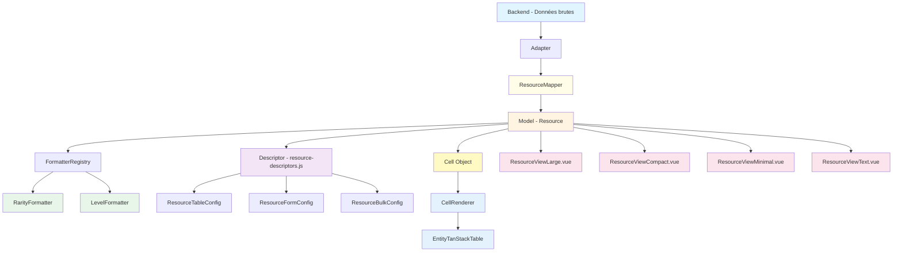

# Architecture du système d'entités — Vue d'ensemble

**Date de création** : 2026-01-XX  
**Contexte** : Architecture claire en 4 couches pour le système d'entités frontend

---

## 🎯 Principe directeur

> **Une entité n'est pas une vue**  
> **Une vue n'est pas une config**  
> **Une config n'est pas de la logique**

Le système d'entités de KrosmozJDR est un **framework métier orienté entités**. L'architecture repose sur une **mise en tension propre entre 4 couches** : données, règles métier, configuration, rendu.

---

## 📊 Flux de données global

```
Backend (données brutes)
   ↓
Mappers (transformation backend → frontend)
   ↓
Models (logique métier + formatage)
   ↓
Formatters (formatage centralisé)
   ↓
Descriptors (configuration déclarative)
   ↓
Renderers (table, actions, formulaires)
   ↓
Vues (Large / Compact / Minimal / Text)
```

**Chaque couche connaît uniquement la couche juste en dessous, jamais plus.**

### Schéma Mermaid



---

## 🏗️ Architecture en 4 couches

### 1️⃣ **Models** — Le cœur vivant 🫀

**Emplacement :** `resources/js/Models/Entity/`

**Rôle :** Logique métier et formatage des données.

**Principe :**
> **Un modèle sait comment se représenter, mais pas où**

**Responsabilités :**
- ✅ Formatage des données (`toCell()`, `toBadge()`, `formatRarity()`, etc.)
- ✅ Validation des données
- ✅ Transformation des données (raw → model)
- ✅ Cache des cellules générées
- ✅ Logique métier spécifique à l'entité

**❌ Ne contient PAS :**
- ❌ Aucun `v-if`, aucun composant Vue, aucun layout
- ❌ Configuration UI
- ❌ Descriptors

**Exemple :**
```javascript
// Resource.js
export class Resource extends BaseModel {
  toCell(fieldKey, options = {}) {
    // Le modèle génère une représentation, pas un composant
    return {
      type: 'badge',
      value: 'Commun',
      params: { color: 'grey', ... }
    };
  }
}
```

**Règle d'or :** Le modèle ne décide pas du composant, seulement du *type de rendu*.

---

### 2️⃣ **Formatters** — Le système nerveux ⚡

**Emplacement :** `resources/js/Utils/Formatters/`

**Rôle :** Formatage centralisé des propriétés communes aux entités.

**Principe :**
> **Un formatter ne connaît pas l'entité**  
> **Une entité connaît les formatters**

**Caractéristiques :**
- ✅ Formatters **purement statiques**
- ✅ Aucun état
- ✅ Testables indépendamment
- ✅ Enregistrés dans `FormatterRegistry` pour éviter les `switch/case` à l'infini

**Responsabilités :**
- Formatage des valeurs communes (rarity → badge, level → texte, etc.)
- Conversion valeur → label → couleur
- Formatage selon la taille (xs, sm, md, lg, xl)

**Exemple :**
```javascript
// RarityFormatter.js
export class RarityFormatter extends BaseFormatter {
  static toCell(value, options = {}) {
    return {
      type: 'badge',
      value: this.getLabel(value),
      params: {
        color: this.getColor(value),
        ...
      }
    };
  }
}
```

---

### 3️⃣ **Descriptors** — Configuration déclarative 📜

**Emplacement :** `resources/js/Entities/{entity}/`

**Rôle :** Schéma déclaratif qui permet au moteur de générer des outils génériques autour d'une entité.

**Principe :**
> **Le descriptor est un contrat stable entre le moteur et le métier**  
> **Il ne contient aucune logique métier, aucune vue, uniquement de la déclaration**

**Les 4 questions qu'un descriptor doit répondre :**
1. Qui peut voir quoi ? (permissions, visibilité)
2. Comment cette entité se liste ? (tableau)
3. Comment elle s'édite ? (formulaire simple)
4. Comment elle s'édite en masse ? (quickedit)

**Ce que le descriptor fait :**
- ✅ Déclare **quoi est visible** (`visibleFrom('sm')`)
- ✅ Déclare **quoi est éditable** (`editable`, `bulk.enabled`)
- ✅ Déclare **comment configurer le tableau** (`sortable`, `filterable`, `searchable`)
- ✅ Déclare **comment configurer les formulaires** (`type`, `required`, `options`)
- ✅ Déclare **les composants personnalisés** pour les cellules (optionnel)

**Ce qu'il ne fait JAMAIS :**
- ❌ Pas de logique métier (`if rarity === 3`)
- ❌ Pas de formatage (délégué aux formatters)
- ❌ Pas de calculs
- ❌ Pas de logique de rendu
- ❌ Pas d'ordre de layout pour les vues
- ❌ Pas de génération automatique de vues Large/Compact/Minimal/Text
- ❌ Pas d'appels à des modèles
- ❌ Pas d'état ou d'effet de bord

**Structure recommandée :**
```javascript
export class ResourceDescriptor extends EntityDescriptor {
  static entity = 'resource'

  static table(ctx) {
    return TableConfig.create()
      .withPermissions({ quickEdit: ctx.canUpdateAny })
      .withColumns(columns => {
        // Configuration déclarative uniquement
      })
  }

  static form(ctx) {
    return FormConfig.create()
      .group('Général', group => {
        // Configuration déclarative uniquement
      })
  }

  static bulk(ctx) {
    return BulkConfig.create()
      .group('Général', group => {
        // Configuration déclarative uniquement
      })
  }
}
```

**Règle d'or :** Le descriptor parle le langage du moteur (`sortable`, `filterable`, `editable`), pas du métier ("c'est important", "c'est joli").

**Structure :**
```
Entities/
├── entity/                         # Classes de base communes
│   ├── TableConfig.js
│   ├── TableColumnConfig.js
│   ├── FormConfig.js
│   ├── FormFieldConfig.js
│   └── BulkConfig.js
│
└── resource/                       # Configuration Resource
    ├── resource-descriptors.js     # Descriptors de champs (table + form)
    ├── ResourceTableConfig.js      # Configuration tableau
    ├── ResourceFormConfig.js       # Configuration formulaire
    ├── ResourceBulkConfig.js       # Configuration bulk edit
    └── resource-adapter.js         # Adapter (raw → model)
```

**Exemple de descriptor :**
```javascript
// resource-descriptors.js
export const getResourceFieldDescriptors = (ctx) => ({
  rarity: {
    key: "rarity",
    label: "Rareté",
    icon: "fa-solid fa-star",
    display: {
      sizes: {
        xs: { mode: "badge" },
        sm: { mode: "badge" },
        // ...
      },
      // Optionnel : composant personnalisé
      cell: {
        component: '@/Pages/Atoms/data-display/CustomRarityCell.vue',
        props: { format: 'badge' }
      }
    },
    edit: {
      form: {
        type: "select",
        options: [...],
        bulk: { enabled: true }
      }
    }
  }
});
```

**Règle de décision :**
> "Est-ce que cette info est nécessaire pour générer automatiquement quelque chose ?"  
> Si oui → descriptor  
> Sinon → vue ou modèle

---

### 4️⃣ **Renderers** — Moteurs génériques 🧩

**Emplacement :** `resources/js/Pages/Organismes/` et `resources/js/Pages/Atoms/`

**Rôle :** Composants génériques pour afficher les entités (tableau, actions, formulaires).

**Principe :**
> **Le tableau ne connaît pas les entités**  
> **Il affiche des `cells`**  
> **Chaque `cell.type` correspond à un composant**

**Structure des cellules :**
```javascript
Cell = {
  type: 'badge' | 'icon' | 'text' | 'route' | 'image' | 'custom',
  value: any,
  params: {
    // Props pour le composant
    color?: string,
    href?: string,
    tooltip?: string,
    // Composant personnalisé (si type === 'custom')
    component?: string | Component,
    componentProps?: Object
  }
}
```

**Composants génériques :**
- `EntityTanStackTable.vue` — Tableau générique
- `EntityActions.vue` — Actions génériques
- `EntityQuickEditPanel.vue` — Panneau d'édition rapide
- `EntityQuickEditModal.vue` — Modal d'édition rapide
- `EntityEditForm.vue` — Formulaire d'édition générique
- `CellRenderer.vue` — Rendu d'une cellule (atom)

**Exemple de rendu :**
```vue
<!-- CellRenderer.vue -->
<component
  v-if="hasCustomComponent"
  :is="customComponent"
  v-bind="customComponentProps"
/>
<Badge v-else-if="type === 'badge'" ... />
<Route v-else-if="type === 'route'" ... />
<!-- ... -->
```

---

### 5️⃣ **Vues** — Layouts libres 🖌️

**Emplacement :** `resources/js/Pages/Molecules/entity/{entity}/`

**Rôle :** Vues manuelles spécifiques à chaque entité.

**Principe :**
> **Une vue reçoit une `entity`**  
> **Elle appelle des méthodes du modèle**  
> **Elle compose du layout, rien d'autre**

**Formats disponibles :**
- `ResourceViewLarge.vue` — Vue Large (page complète)
- `ResourceViewCompact.vue` — Vue Compact (modal)
- `ResourceViewMinimal.vue` — Vue Minimal (carte)
- `ResourceViewText.vue` — Vue Text (ligne)

**Exemple :**
```vue
<script setup>
import { Resource } from '@/Models/Entity/Resource';

const props = defineProps({
  resource: { type: Object, required: true }
});

const entity = computed(() => new Resource(props.resource));
</script>

<template>
  <section class="grid gap-4">
    <header class="flex justify-between">
      <h1>{{ entity.name }}</h1>
      <EntityActions :entity="entity" context="large" />
    </header>

    <div class="flex gap-2">
      <Badge v-bind="entity.toCell('rarity').params" />
      <Badge v-bind="entity.toCell('level').params" />
    </div>
  </section>
</template>
```

**Règle :** Aucune logique métier ici, juste de l'orchestration visuelle.

---

## 🔄 Flux de données détaillé

### Exemple : Affichage d'une cellule dans le tableau

```
1. Backend renvoie des données brutes
   { id: 1, name: "Bois", rarity: 1, level: 50 }

2. Adapter transforme en modèle
   const resource = new Resource(rawData);

3. Tableau demande une cellule
   const cell = resource.toCell('rarity', {
     size: 'sm',
     context: 'table',
     config: descriptors  // Depuis resource-descriptors.js
   });

4. Modèle utilise le formatter
   → RarityFormatter.toCell(1, options)
   → Retourne { type: 'badge', value: 'Commun', params: {...} }

5. CellRenderer affiche la cellule
   <Badge :color="cell.params.color">{{ cell.value }}</Badge>
```

---

## 📁 Structure complète des fichiers

```
resources/js/
├── Models/
│   ├── BaseModel.js
│   └── Entity/
│       ├── Resource.js
│       ├── Item.js
│       └── ...
│
├── Utils/
│   └── Formatters/
│       ├── BaseFormatter.js
│       ├── FormatterRegistry.js
│       ├── RarityFormatter.js
│       ├── LevelFormatter.js
│       └── ...
│
├── Entities/
│   ├── entity/                      # Classes de base
│   │   ├── TableConfig.js
│   │   ├── TableColumnConfig.js
│   │   ├── FormConfig.js
│   │   ├── FormFieldConfig.js
│   │   └── BulkConfig.js
│   │
│   └── resource/                    # Configuration Resource
│       ├── resource-descriptors.js   # Descriptors de champs
│       ├── ResourceTableConfig.js    # Config tableau
│       ├── ResourceFormConfig.js     # Config formulaire
│       ├── ResourceBulkConfig.js     # Config bulk
│       └── resource-adapter.js       # Adapter (raw → model)
│
├── Pages/
│   ├── Atoms/
│   │   └── data-display/
│   │       ├── CellRenderer.vue      # Rendu cellule
│   │       ├── Badge.vue
│   │       └── ...
│   │
│   ├── Molecules/
│   │   └── entity/
│   │       └── resource/
│   │           ├── ResourceViewLarge.vue
│   │           ├── ResourceViewCompact.vue
│   │           ├── ResourceViewMinimal.vue
│   │           └── ResourceViewText.vue
│   │
│   └── Organismes/
│       ├── table/
│       │   └── EntityTanStackTable.vue
│       └── entity/
│           ├── EntityActions.vue
│           ├── EntityQuickEditPanel.vue
│           └── EntityEditForm.vue
│
└── Composables/
    ├── useBulkEditPanel.js
    ├── useEntityActions.js
    └── usePermissions.js
```

---

## 🎯 Règles d'or par couche

### Models
- ✅ Savent comment se représenter (`toCell()`, `toBadge()`)
- ❌ Ne savent pas où ils seront affichés
- ❌ Ne contiennent pas de composants Vue

### Formatters
- ✅ Purement statiques, sans état
- ✅ Ne connaissent pas l'entité
- ✅ Testables indépendamment

### Descriptors
- ✅ Configuration déclarative uniquement
- ✅ Déclarent quoi est visible/éditable
- ❌ Pas de logique de rendu
- ❌ Pas de génération automatique de vues

### Renderers
- ✅ Moteurs génériques
- ✅ Ne connaissent pas les entités spécifiques
- ✅ Affichent des `cells` avec des types

### Vues
- ✅ Layouts libres et personnalisables
- ✅ Appellent les méthodes du modèle
- ❌ Aucune logique métier

---

## 🔗 Points d'intégration

### 1. Descriptors → Models
Les descriptors sont passés aux modèles via `options.config` :
```javascript
entity.toCell('rarity', {
  config: descriptors,  // Depuis resource-descriptors.js
  size: 'sm'
});
```

### 4. Models → Formatters
Les modèles utilisent le `FormatterRegistry` :
```javascript
const FormatterClass = getFormatter('rarity');
const cell = FormatterClass.toCell(this._data.rarity, options);
```

### 5. Models → Renderers
Les modèles retournent des objets `Cell` :
```javascript
{
  type: 'badge',
  value: 'Commun',
  params: { color: 'grey', ... }
}
```

### 6. Renderers → Vues
Les vues utilisent les composants génériques :
```vue
<EntityActions :entity="entity" />
<Badge v-bind="entity.toCell('rarity').params" />
```

---

## ✅ Ce qui est bien fait (à garder)

- ✔ Séparation table / form / bulk
- ✔ Cache des descriptors
- ✔ Composables dédiés
- ✔ Actions centralisées
- ✔ Permissions découplées
- ✔ Système de formatters centralisés
- ✔ Vues manuelles personnalisables

---

## 🎯 En une phrase

> **Le frontend est un moteur générique qui orchestre des modèles intelligents et des vues libres**

---

## 📚 Documents complémentaires

- [ARCHITECTURE_ENTITIES_ATOMIC_DESIGN.md](./ARCHITECTURE_ENTITIES_ATOMIC_DESIGN.md) — Structure des fichiers selon Atomic Design
- [MAPPERS_PATTERN.md](./MAPPERS_PATTERN.md) — Pattern des mappers (transformation backend → frontend)
- [PLAN_REFACTORING_ENTITIES.md](./PLAN_REFACTORING_ENTITIES.md) — Plan de migration
- [New Système d'Entity.md](./New%20Système%20d'Entity.md) — Spécifications détaillées
