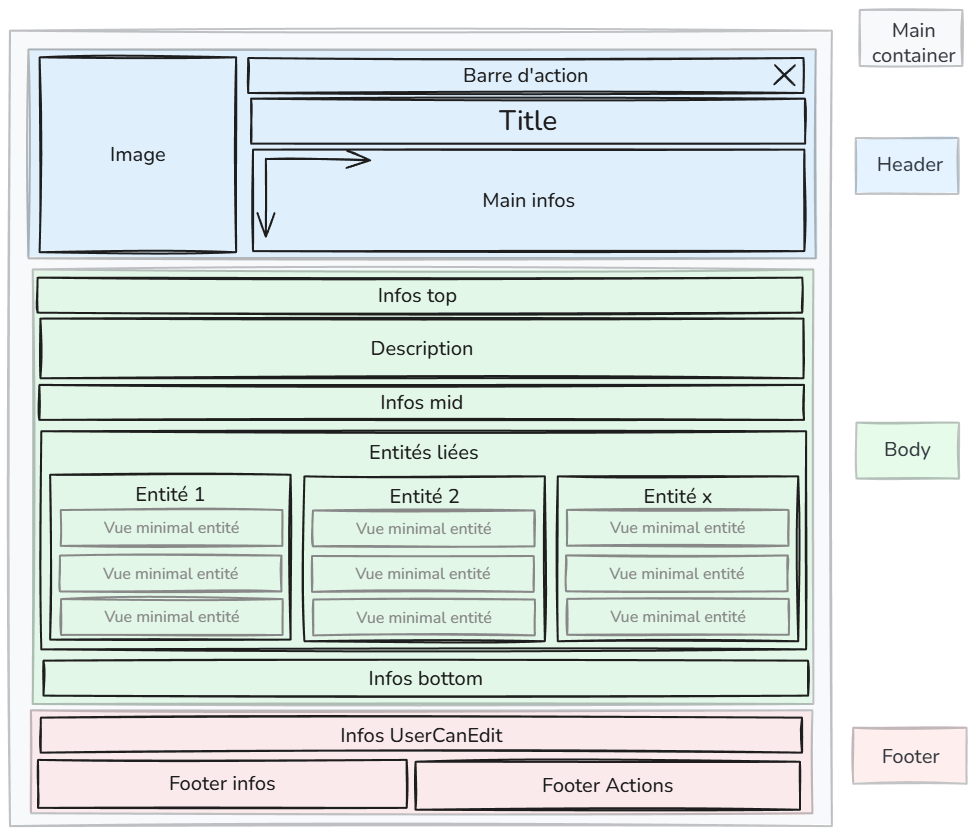

# Schéma généralite d'une vue d'entité

# Propriétés d'entités
## Desgin
### Vue Large 
- On affiche le nom de propriété ainsi que l'icône associé si elle existe puis on affiche la valeur
- On affiche le helper en dure assez discret (format commentaire par exemple) si cela parait nécessaire
### Vue Compact
- On affiche juste la valeur si le reste n'est pas nécessaire.
- On préférera utiliser une abréviation du nom et / ou une icone
### Vue Minimal
- On affiche juste la valeur si le reste n'est pas nécessaire
- Sinon, on préviligie l'icone et si vraiment il y a besoin, on utilise l'abréviation.

## Liste des propriétés

| Propriété                                                                                      | Section préférable                  | Priorité | Icone | Nom                                                     | Abrégé                                | Vue Minimal | Vue Compact | Vue Large | Permission |
| ---------------------------------------------------------------------------------------------- | ----------------------------------- | -------- | ----- | ------------------------------------------------------- | ------------------------------------- | ----------- | ----------- | --------- | ---------- |
| state                                                                                          | Sous forme de dot en haut à gauche  | 5        | v     | État                                                    |                                       | V           | V           | N + V     | all        |
| read_level                                                                                     | Infos UserCanEdit                   | 3        | -     | Lecture min.                                            | -                                     | -           | N + V       | N + V     | all        |
| write_level                                                                                    | Infos UserCanEdit                   | 3        | -     | Écriture min.                                           | -                                     | -           | N + V       | N + V     | canEdit    |
| created_by                                                                                     | Infos UserCanEdit                   | 1        | -     | Créé par                                                | -                                     | -           | N + V       | N + V     | canEdit    |
| created_at                                                                                     | Infos UserCanEdit                   | 1        | -     | Créé le                                                 | -                                     | -           | N + V       | N + V     | canEdit    |
| updated_at                                                                                     | Infos UserCanEdit                   | 2        | -     | Mis à jour le                                           | -                                     | -           | N + V       | N + V     | canEdit    |
| dofus_version                                                                                  | Infos UserCanEdit                   | 0        | -     | Version                                                 |                                       | -           | N + V       | N + V     | admin      |
| auto_update                                                                                    | Infos UserCanEdit                   | 2        | -     | Mise à jour automatique depuis des sources externes     | Maj Auto                              | -           | A + V       | A + V     | admin      |
| official_id                                                                                    | Infos UserCanEdit                   | 0        | -     |                                                         | -                                     | -           | N + V       | N + V     | admin      |
| dofusdb_id                                                                                     | Infos UserCanEdit                   | 0        | -     |                                                         | -                                     | -           | N + V       | N + V     | admin      |
| id                                                                                             | Infos UserCanEdit                   | 2        | -     |                                                         | -                                     | -           | N + V       | N + V     | canEdit    |
| state                                                                                          | main info                           | 3        | -     | Etat                                                    | -                                     | N + V       | N + V       | N + V     | all        |
| is_public                                                                                      | main_info                           | 2        | -     | -                                                       | -                                     | V           | V           | V         | canEdit    |
| level                                                                                          | main_info                           | 6        | v     | Niveau                                                  | Nv                                    |             |             |           | all        |
| pa, po, pm                                                                                     | main_info, info_top              | 5        | v     | Points de ...                                           | PA, PM ou PO                          | I + V       | I  + A+ V   | I + N +V  | all        |
| po_editable                                                                                    | main_info, info_top              | 4        | v     | Portée modifiable                                       | PO modif                              | I + V       | I + V       | I + A +V  | all        |
| time_before_use_again                                                                          | main_info, info_top              | 2        | v     |                                                         |                                       | I + V       | I + V       | I + N +V  | all        |
| castng_time                                                                                    | main_info, info_top              | 2        | v     |                                                         |                                       | I + V       | I + V       | I + N +V  | all        |
| duration                                                                                       | main_info, info_top              | 4        | v     |                                                         |                                       | I + V       | I + V       | I + N +V  | all        |
| cast_per_turn                                                                                  | main_info, info_top              | 2        | v     |                                                         |                                       | I + V       | I+V         | I + N + V | all        |
| cast_per_target                                                                                | main_info, info_top              | 2        | v     |                                                         |                                       | I + V       | I+V         | I + N + V | all        |
| sight_line                                                                                     | main_info, info_top              | 3        | v     |                                                         |                                       | I + V       | I+V         | I + N + V | all        |
| number_between_two_cast                                                                        | main_info, info_top              | 2        | v     |                                                         |                                       | I + V       | I+V         | I + N + V | all        |
| number_between_cast_editable                                                                   | main_info, info_top              | 2        | v     |                                                         |                                       | I + V       | I+V         | I + N + V | all        |
| area                                                                                           | main_info, info_top              | 3        | v     |                                                         |                                       | I + V       | I+V         | I + N + V | all        |
| is_magic                                                                                       | main_info, info_top              | 4        | v     |                                                         |                                       | I + V       | I + N +V    | I + N +V  | all        |
| ritual_available                                                                               | main_info, info_top              | 2        | v     |                                                         |                                       | I + V       | I + N +V    | I + N +V  | all        |
| powerfull                                                                                      | main_info, info_top              | 2        | v     |                                                         |                                       | I + V       | I + N +V    | I + N +V  | all        |
| life                                                                                           | main_info, info_top              | 4        | v     | Vie                                                     | -                                     |             |             |           | all        |
| life_dice                                                                                      | main_info, info_top              | 5        | v     | Valeur du Dé de vie                                     | Dé de vie                             | I  + V      | I  + V      | I + A + V | all        |
| price / kamas                                                                                  | info_top, info_mid               | 1        | v     | Prix                                                    | -                                     | I-V         | I+V         | I + N + V | all        |
| rarity                                                                                         | main_info                           | 3        | -     | Rareté                                                  | -                                     | V           | V           | N + V     | all        |
| type_...                                                                                       | main_info                           | 5        | -     | Type de ...                                             | -                                     | V           | V           | N + V     | all        |
| is_boss                                                                                        | main_info (afficher que si boss)    | 4        | v     | Boss                                                    | -                                     | V           | V           | N + V     | all        |
| size                                                                                           | main_info                           | 5        | -     | Taille                                                  | ⸱                                     | V           | V           | N + V     | all        |
| boss_pa                                                                                        | main_info (afficher que si boss)    | 4        | v     | PA suplémentaire                                        | PA sup                                | I + V       | I + A + V   | I + N + V | all        |
| weight                                                                                         | info_top, info_mid               | 2        | v     | Poids                                                   | -                                     | I + V       | I + V       | I + N + V | all        |
| hostility                                                                                      | main_info,i nfo_top, info_mid | 4        | -     | Aggressivité                                            | -                                     | V           | V           | N + V     | all        |
| ini                                                                                            | info_top, info_mid               | 4        | v     | Initiative                                              | Ini                                   | I + V       | I + A + V   | I + N + V | all        |
| invocation                                                                                     | main_info, info_top, info_mid | 4        | v     | Invocation                                              | Invoc                                 | I + V       | I + A + V   | I + N + V | all        |
| touch                                                                                          | main_info, info_top, info_mid | 3        | v     | Bonus de touche                                         | Touche                                | I + V       | I + A + V   | I + N + V | all        |
| ca                                                                                             | main_info, info_top, info_mid | 3        | v     | Classe d'armure                                         | CA                                    | I + V       | I + A + V   | I + N + V | all        |
| dodge_ pa ou pm                                                                                | nfo_top, info_mid                | 2        | v     | Esquive PM, PA                                          | -                                     | I + V       | I + V       | I + N + V | all        |
| fuite / tacle                                                                                  | nfo_top, info_mid                | 2        | v     | Fuite, Tacle                                            | -                                     | I + V       | I + V       | I + N + V | all        |
| vitality / sagesse / strong / intel / agi / chance                                             | nfo_top                             | 5        | v     | Vitalité, Sagesse, Force, Agilité, Chance, Intelligence | Vita, Sasa, Force, Agi, Chance, Intel | I + V       | I + V       | I + N + V | all        |
| do_fixe_ ...                                                                                   | nfo_top, info_mid                | 3        | v     | Dommage fixe                                            | Do fixe                               | I + V       | I + A + V   | I + N + V | all        |
| res_                                                                                           | nfo_top, info_mid                | 3        | v     | Résistance, résistance fixe                             | Res, Res fixe                         | I + V       | I + A + V   | I + N + V | all        |
| bonus de compétence (acrobatie_bonus, ...) Maitrise de compétence (acrobatie_mastery) | info_mid, info_bottom            | 1        | v     | Nom de la compétence                                    | -                                     | N + V       | N + V       | N + V     | all        |
|                                                                                                |                                     |          |       |                                                         |                                       |             |             |           |            |

N : nom ou A : Abrégé
V : Valeur
I : Icone
Ex : N + V = nom + valeur

# Main container
- Couleur : certaines propriétés comme l'élément d'un sort ou d'une aptitude ou le type d'une ressource peuvent influencer la couleur de l'ombre du contour
- Taille : 
	- en compact et Large, la vue prend la place maximale qu'il peut. On pourra calculer une valeur xs, sm, md, lg ou xl commun à ces deux vues pour avoir une référence pour les éléments qui compose la vue.
	- en minimal : la taille peut être fixer (xs, sm, md, lg, xl ou auto). Auto revient à prendre la place maximale, les autres permettent de fixer une largeur.
	- La vue minimal est la seule vu qui peut être limiter en hauteur. Dans ce cas là :
		- le title et la barre d'action sont sur la même ligne et la barre d'action est sous forme de menu
		- le title est sur une seule ligne et il est tronqué si il dépasse
		- les infos principales sont sur 1 à 2 lignes maximal en fonction de la hauteur que l'on a.
		- Le reste est masqué (body et footer). ils ne se dévoillent qu'au hover. C'est le mode extended ou compacted de la vue minimal.
- La vue texte est juste l'image de l'entité avec son nom à la suite et une vue au hover qui ouvre la vue minimal. 
# Header
## Image
- elle a un format carré, centré en x et y
- le fond est transparent
- Si la taille de la vue n'est pas trop petite (plus de 200px), alors elle prend 1/3 de la largeur environ. Sinon elle prend la place que lui laisse l'affichage du titre.
- On peut interagir avec elle pour l'ouvrir en pleine écran et zoomer à l'intérieur (plugin à choisir). Il serai bien d'avoir un plugin qui nous permet de la tourner et de l'enregistrer ainsi ou de zoomer, tronquer, etc si on est admin. hors admin, on pourrai juste zoomer sans enregistrer ou télécharger l'image.
## Barre d'action
- Les actions différent selon les permissions du User
- La seule action est toujours affichés et qui est pour tout le monde, c'est la croix pour fermer lorsqu'on est dans un modal.
- les actions peuvent dépendre du contexte (modal, page, edition, permissions, etc)
- Les actions sont sous formes d'icone avec un tooltips / helper
- en fonction de la place, on va masquer certaines actions et les mettre dans un menu (on peut aller jusqu'à toutes les mettre à l'exception du bouton fermer si il est présent)
- voici les actions (j'ai aussi mis les actions visibles depuis les tableaux):
  
| Actions                       | Modal | Page | Edition Modal | Edition Page | Table | Permission |
| ----------------------------- | ----- | ---- | ------------- | ------------ | ----- | ---------- |
| Fermer                        | v     |      | v             |              |       | all        |
| Ouvrir dans Modal             |       | v    | v             |              | v     | all        |
| Ouvrir dans Page              | v     |      |               | v            | v     | all        |
| Minimiser                     | v     | v    | v             | v            |       | all        |
| Mettre en favoris             | v     | v    | v             | v            | v     | connecté   |
| Editer dans Modal             | v     |      |               | v            | v     | canEdit    |
| Editer dans Page              |       | v    | v             |              | v     | canEdit    |
| Rafraichir via scrapping      | v     | v    | v             | v            | v     | admin      |
| Rafraichir depuis le serveur  | v     | v    | v             | v            | v     | admin      |
| Revenir en arrière (ctrl + Z) |       |      | v             | v            |       | canEdit    |
| Exporter en PDF               | v     | v    |               |              | v     | all        |
| Copier l'URL                  | v     | v    | v             | v            | v     | all        |
| Supprimer                     |       |      | v             | v            | v     | admin      |
| Dupliquer                     | v     | v    | v             | v            | v     | canEdit    |
## Title
- Le title peut être sur plusieurs lignes (sauf en vue minimal compacted où il est sur 1 seul ligne)
- Le texte est mis en valeur en étant un tout petit peu plus gros que les autres textes.
## Main infos
- Cette section réservée aux infos décrivant le mieux les entités.
- En fonction de comment du nombre et de leurs tailles, on peut utiliser plusieurs lignes ou colonnes.
- En règles général ces infos ne sont pas cachés même dans la vue minimal compact.
# Body
- Dans le cas d'une vue minimal compact, cette section Body n'est affiché qu'au hover.
## Infos top
- Cette section est réservé aux propriétés importes mais non essentiel.
## Description
- Cette section comprend la description de l'entité mais aussi tout autre gros texte comme effect ou alors tout ce qui est infograpgie prenant de la place.
## Infos mid
- Cette section est réservé aux propriétés qui n'ont pas besoin d'être mise en avant.
## Entités liées
- Cette section permet de lister les liens de l'entité concerné avec les autres entités.
- En fonction du nombre en quantité et en qualité (nombre différentes d'entités), on peut faire des listes verticals, horizontals, des mixtes... C'est au cas par cas.
- Les entités liés sont affichés en vue minimal compact ou en vue texte si on est en vue minimal ou compact avec une petite taille.
## Infos bottom
- Cette section est réservé aux propriétés peu importantes.
- Cette section est rarement utilisé
# Footer
 - Dans le cas d'une vue minimal compact, cette section Footer n'est pas affiché même une fois étendu.
## Infos UserCanEdit
- Cette section est réservé aux infos de base d'une entité réservé aux users qui peuvent la modifier (ID, date de création, date d'update, etc)
## Footer infos
- Cette section est réservé à des informations qui sont mis à jour en direct par exemple si l'entité a été modifié et pas encore enregistré, si il y a une erreur, etc ou d'autres métadonnées lié à l'entitée mais qui ne sont pas une de ces propriétés.
## Footer Actions
- Cette section est réservé aux boutons d'interaction avec les données du type "Annuler", "Réinitialiser", "Enregistrer".