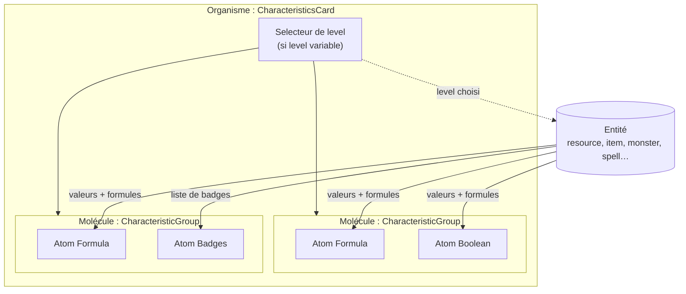
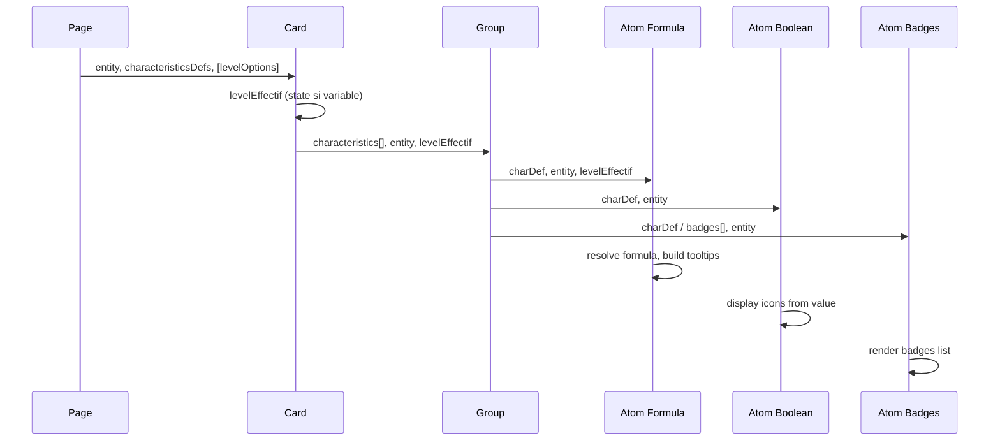

# Schéma UI — Carte de caractéristiques (Atomic Design)

**Objectif** : Définir l’architecture des composants d’affichage des **caractéristiques classiques** pour les entités (ressource, équipement, consommable, monstre, NPC, sort), en Atomic Design : atomes → groupes (molécules) → carte (organisme).

**Périmètre** : On ne traite ici que les **caractéristiques classiques** (valeur, formule, booléen, badges). Les **relations** (liens vers d’autres entités) et l’affichage **nom/description** de l’entité sont gérés ailleurs et pourront être insérés dans la carte via d’autres modules.

**Références** :
- [ENTITY_VIEWS.md](./ENTITY_VIEWS.md) — Conventions Large/Compact/Minimal
- [ATOMIC_DESIGN.md](./ATOMIC_DESIGN.md) — Philosophie Atomic Design
- [TYPES_VALEURS_ET_CONTENU_JSON.md](../50-Fonctionnalités/Characteristics-DB/TYPES_VALEURS_ET_CONTENU_JSON.md) — Types de caractéristiques (boolean, list, string)
- [PRESENTATION_SERVICE_CARACTERISTIQUES.md](../50-Fonctionnalités/Characteristics-DB/PRESENTATION_SERVICE_CARACTERISTIQUES.md) — Service caractéristiques

---

## 1. Vue d’ensemble



- **Atomes** : affichage d’**une** caractéristique (formule, booléen ou badges).
- **Molécules (Groupes)** : regroupement cohérent d’atomes (ex. stats de combat, stats de vie).
- **Organisme (Carte)** : conteneur qui affiche les groupes, fournit le **contexte d’entité** et le **level** (avec sélecteur si level variable : `1d6+4`, `[5-10]`).

---

## 2. Les trois types d’atomes

Les caractéristiques sont distinguées par leur **type** (voir `characteristics.type` et [TYPES_VALEURS_ET_CONTENU_JSON.md](../50-Fonctionnalités/Characteristics-DB/TYPES_VALEURS_ET_CONTENU_JSON.md)). En UI on a **trois familles d’atomes** :

| Type atome | Caractéristiques concernées | Rôle |
|------------|-----------------------------|------|
| **Formula** | `string` / numériques avec formule | Valeur + formule résolue, tooltips, optionnel tableau par level |
| **Boolean** | `boolean` | Souvent 2 états (2 icônes), compact |
| **Badges** | `list` ou ensemble de libellés (ex. taille) | Liste de badges (ex. « Taille immense », « Volatil ») |

### 2.1 Atome **CharacteristicFormula** (caractéristique à formule)

- **Données d’entrée** :
  - Définition de la caractéristique (label, icône, couleur, unité, description pour tooltip).
  - Définition entité (formule, formula_display, min, max, etc. selon `characteristic_object` / `characteristic_creature` / `characteristic_spell`).
  - **Entité** (objet) : pour résoudre les variables (ex. level, vitalité).
  - **Level effectif** (optionnel) : fourni par la carte quand le level est variable.
- **Affichage condensé** :
  - Bloc valeur (taille selon contenu, troncature si trop long).
  - Au-dessus : icône + label en inline.
- **Affichage étendu (hover)** :
  - Bloc en `position: absolute` pour ne pas déformer le layout.
  - Label en haut, icône + valeur en inline en dessous.
  - Tooltips : sur label/icône → description de la caractéristique ; sur formule résolue → formule brute.
  - Sous la valeur : **formule résolue** avec variables remplacées (ex. `[Vitalité] -1 + [Level] / 3` → `5 -1 + 8`), avec couleurs par caractéristique. Si variables manquantes → afficher la formule brute.
  - Si **plusieurs levels possibles** (ex. 1d4, [5-8]) : petit **tableau** niveau → résultat (affiché uniquement en mode étendu).
- **Accès** : le composant reçoit l’**entité** (ou un objet dérivé contenant level + caractéristiques déjà résolues) pour calculer la valeur et la formule affichée.

### 2.2 Atome **CharacteristicBoolean**

- **Données d’entrée** : caractéristique de type `boolean`, entité (pour valeur calculée ou défaut), définition (icône, couleurs, description).
- **Affichage** : souvent **deux icônes** (oui/non) selon la valeur, très compact. Tooltip sur l’icône active pour la description.
- Pas de formule résolue ni de tableau par level dans le cas booléen simple.

### 2.3 Atome **CharacteristicBadges**

- **Données d’entrée** : une **liste** de valeurs (ex. libellés de taille, états) ou une caractéristique de type `list` avec valeurs possibles + valeur courante.
- **Affichage** : **liste de badges** (ex. « Taille immense », « Volatil »). Chaque badge peut avoir icône/couleur si défini dans le référentiel.
- Pas de formule ni de level ; affichage condensé possible (badges wrap).

---

## 3. Molécule : CharacteristicGroup

- **Rôle** : regrouper des atomes (Formula, Boolean, Badges) qui ont du sens ensemble (ex. « Stats de combat », « Stats de vie », « Propriétés spéciales »).
- **Contenu** : liste d’atomes (chaque atome reçoit sa caractéristique + définition + entité + level effectif).
- **Layout** : placement cohérent (grille, flex, ordre défini par config ou `sort_order`).
- **Pas de logique métier** : le groupe ne fait que composer les atomes et leur passer les props.

La **configuration des groupes** (quelles caractéristiques dans quel groupe, ordre) peut venir du backend (ex. `characteristics.group`, `sort_order`) ou d’une config de vue par type d’entité.

---

## 4. Organisme : CharacteristicsCard

- **Rôle** :
  - Conteneur principal (carte).
  - Fournir l’**entité** et le **level effectif** à tous les atomes (via groupes).
  - Si le level de l’entité est **variable** (ex. `1d6+4`, `[5-10]`) : afficher un **sélecteur de level** ; la valeur choisie est utilisée comme level effectif pour résoudre les formules dans tous les atomes.
- **Contenu** :
  - Optionnel : sélecteur de level (en tête ou à un endroit dédié).
  - Une ou plusieurs **CharacteristicGroup** (molécules).
  - Autres modules (relations, nom/description, etc.) peuvent être insérés dans la même carte en dehors de ce schéma.
- **Données** :
  - **Entité** : resource, item, consumable, monster, npc, spell, etc. (avec au minimum les champs nécessaires aux formules : level, caractéristiques utilisées).
  - **Définitions des caractéristiques** : tableau des caractéristiques avec label, icône, couleur, description, type, formules (par entité).

---

## 5. Modèles et entités nécessaires

### 5.1 Backend (déjà présents)

| Modèle / Table | Rôle |
|----------------|------|
| **Characteristic** | Référentiel : `key`, `name`, `short_name`, `icon`, `color`, `unit`, `type` (string/boolean/list), `sort_order`, `group`, `descriptions`, `helper`. Pas de relation ni nom d’entité ici : uniquement la définition « classe » de la caractéristique. |
| **CharacteristicObject** | Définition pour objet (item, consumable, resource, panoply) : `formula`, `formula_display`, `min`, `max`, `default_value`, etc. |
| **CharacteristicCreature** | Définition pour créature (monster, class, npc) : idem. |
| **CharacteristicSpell** | Définition pour sort : idem. |
| **Entités** (Item, Resource, Consumable, Monster, Npc, Spell, etc.) | Données d’instance : `level` (string : valeur fixe, `1d4`, `[5-8]`, etc.), champs bruts ou calculés pour les caractéristiques. |

Les **relations** (entité ↔ autre entité) et le **nom/description** de l’entité ne font pas partie de ce module « caractéristiques classiques » ; ils sont fournis par d’autres blocs insérables dans la carte.

### 5.2 Frontend (à prévoir / aligner)

| Élément | Rôle |
|--------|------|
| **Payload entité** | Pour chaque type d’entité (resource, item, monster, spell…), le backend doit fournir au moins : champs nécessaires aux formules (level, caractéristiques utilisées dans les formules), et idéalement les **valeurs déjà calculées** par caractéristique (optionnel si calcul côté frontend). |
| **Référentiel caractéristiques** | Liste des caractéristiques avec label, icône, couleur, type, description (pour tooltips), et pour l’entité courante : formule, formula_display, value_available (list), etc. Peut être construit à partir de Characteristic + CharacteristicObject/Creature/Spell selon le type d’entité. |
| **Level effectif** | Si level variable : soit une liste d’options (ex. 5, 6, 7, 8 pour `[5-8]`), soit un dé (ex. 1d4 → 1..4). Le composant carte gère le state « level choisi » et le passe aux atomes. |
| **Résolution des formules** | Soit backend (valeurs pré-calculées + formule résolue pour affichage), soit frontend (service de résolution avec variables remplacées). Les variables (ex. `[Level]`, `[Vitalité]`) doivent être documentées (voir [SYNTAXE_FORMULES_CARACTERISTIQUES.md](../10-BestPractices/SYNTAXE_FORMULES_CARACTERISTIQUES.md)). |

### 5.3 Résumé des besoins données

- **Carte** : reçoit **entité** + **définitions des caractéristiques** (par groupe/ordre) + **level effectif** (état local si sélecteur).
- **Groupe** : reçoit **liste de caractéristiques** (avec définition + valeur/formule pour cette entité) + **entité** + **level effectif**.
- **Atome Formula** : reçoit **une** caractéristique (définition + définition entité) + **entité** + **level effectif** ; affiche valeur, formule résolue, tooltips, tableau par level si pertinent.
- **Atome Boolean** : reçoit **une** caractéristique booléenne + **entité** ; affiche les 2 icônes (état actif selon valeur).
- **Atome Badges** : reçoit **une** caractéristique liste ou **une liste** de libellés/badges ; affiche la liste de badges.

---

## 6. Flux de données (résumé)



---

## 7. Fichiers et emplacements suggérés

| Couche | Emplacement suggéré | Description |
|--------|---------------------|-------------|
| **Atomes** | `resources/js/Pages/Atoms/data-display/` | `CharacteristicFormula.vue`, `CharacteristicBoolean.vue`, `CharacteristicBadges.vue` |
| **Molécule** | `resources/js/Pages/Molecules/` ou `Organisms/` selon convention projet | `CharacteristicGroup.vue` |
| **Organisme** | `resources/js/Pages/Organisms/` | `CharacteristicsCard.vue` |
| **Composables / services** | `resources/js/Composables/` ou `Utils/` | Résolution formules (si frontend), parsing level variable (1d4, [5-10]) |
| **Types / contrats** | `resources/js/Types/` ou dans les composants | Types pour entity, characteristicDef, levelOptions |

### Implémentation réalisée

- **Atomes** : `CharacteristicFormula.vue`, `CharacteristicBoolean.vue`, `CharacteristicBadges.vue` (dans `Pages/Atoms/data-display/`).
- **Molécule** : `CharacteristicGroup.vue` (dans `Pages/Molecules/data-display/`).
- **Organisme** : `CharacteristicsCard.vue` (dans `Pages/Organismes/data-display/`).
- **Util** : `useCharacteristicLevel.js` (dans `Utils/Entity/`) pour parser `level` (1d4, [5-8], valeur fixe) en options de sélecteur.

### Exemple d’utilisation (CharacteristicsCard)

```vue
<CharacteristicsCard
  :entity="entity"
  :groups="[
    {
      title: 'Stats de combat',
      characteristics: [
        {
          type: 'formula',
          def: { key: 'action_points_creature', name: 'PA', icon: 'icons/caracteristics/actionPoints.webp', color: '#3b82f6' },
          value: 8,
          formulaResolved: '6 + 2',
          formulaRaw: '[base_pa] + [bonus]',
        },
        {
          type: 'boolean',
          def: { key: 'sight_line', name: 'Ligne de vue', icon: 'fa-eye' },
          value: true,
        },
      ],
    },
    {
      title: 'Propriétés',
      characteristics: [
        {
          type: 'badges',
          items: [{ label: 'Taille immense', color: '#8b5cf6' }, { label: 'Volatil' }],
        },
      ],
    },
  ]"
  @update:level-effective="onLevelChange"
/>
```

Le parent doit fournir `groups` avec pour chaque caractéristique : `type` ('formula' | 'boolean' | 'badges'), `def` (définition avec au minimum `key`, `name`, et selon le type `icon`, `color`, `descriptions`, etc.), et les champs spécifiques (`value`, `formulaResolved`, `formulaRaw`, `levelTable` pour formula ; `value` pour boolean ; `items` ou `value` pour badges). Quand le level est variable, la carte émet `update:levelEffective` ; le parent peut alors recalculer les valeurs et mettre à jour `groups`.

---

## 8. Synthèse

- **Atomes** : 3 types (Formula, Boolean, Badges), chacun affiche **une** caractéristique avec les options décrites (condensé / étendu, tooltips, formules).
- **Groupes** : regroupement logique d’atomes, placement cohérent.
- **Carte** : conteneur, fournit entité + level effectif, sélecteur de level si besoin.
- **Modèles** : Characteristic + CharacteristicObject/Creature/Spell (déjà en place) ; entités avec `level` ; côté frontend payload + référentiel caractéristiques + résolution formules.
- **Hors scope de ce schéma** : relations entre entités, nom/description de l’entité (à insérer dans la carte via d’autres composants).

Ce document peut servir de base pour l’implémentation des composants et des API (backend/frontend) nécessaires à la carte de caractéristiques.

---

## 9. Vérification compatibilité — Modèles et composants JS

### 9.1 Modèles entités (backend)

| Entité | Champ `level` | Données pour formules | Compatible |
|--------|----------------|------------------------|------------|
| **Item** | `level` (string, nullable) | level ; pas de colonnes par caractéristique (bonus/effect en texte) | Oui. Valeurs à dériver des définitions + level ou champs bruts. |
| **Resource** | `level` (string) | Idem item. | Oui. |
| **Consumable** | `level` (string, nullable) | Idem. | Oui. |
| **Monster** (via Creature) | `creature.level` (string) | Creature a toutes les colonnes (life, pa, pm, vitality, strong, intel, etc.) → variables pour formules. | Oui. |
| **Npc** (via Creature) | Idem. | Idem. | Oui. |
| **Spell** | `level` (string) | Colonnes po, pa, area, etc. | Oui. |

- **Level variable** : `level` est bien une string (ex. `"5"`, `"1d4"`, `"[5-8]"`). Le parsing 1d4 / plage pour le sélecteur est à faire côté frontend ou exposé par l’API.
- **Résolution des formules** : `FormulaResolutionService` attend un tableau `variables` (ex. `['level' => 5, 'vitality' => 12]`). Pour **Creature**, les valeurs viennent des attributs du modèle (db_column → attribut). Pour **Object/Spell**, il faut fournir au moins `level` (et autres champs si définis) ; un endpoint ou payload « caractéristiques résolues » par entité est recommandé.

### 9.2 Référentiel caractéristiques (backend)

- **CharacteristicGetterService::getDefinition()** retourne un tableau avec : `key`, `name`, `short_name`, `descriptions`, `helper`, **`icon`**, **`color`**, `unit`, `type`, `formula`, `formula_display`, `min`, `max`, `default_value`, `value_available` (list), etc.
- **Icon** : en BDD `characteristic.icon` est un **nom de fichier** (ex. `actionPoints.webp`) ou une URL (après upload media). Pour le frontend, normaliser comme dans `MonsterTableController` : si ce n’est pas `fa-` et pas de `/`, préfixer par `icons/caracteristics/` pour que `ImageService.getImageUrl(path)` résolve vers `/storage/images/icons/caracteristics/xxx.webp`.
- **Couleur** : `characteristic.color` est en **hex** (seeders / `characteristic_icons_colors.php`). Les composants DaisyUI (Stat, etc.) utilisent des tokens (primary, success…). Pour afficher la couleur caractéristique : utiliser **style inline** (ex. `color: def.color`) ou **Badge** qui accepte une couleur CSS (hex) via `isValidColor` (colord).

### 9.3 Composants JS réutilisables

| Composant | Fichier | Utilisation prévue | Compatible | Notes |
|-----------|---------|--------------------|------------|--------|
| **Icon** | `Atoms/data-display/Icon.vue` | Icône de la caractéristique (label + valeur). | Oui | `source` : chemin normalisé `icons/caracteristics/xxx.webp` ou `fa-xxx`. **Prop `alt` obligatoire** : passer le nom de la caractéristique (ex. `def.name`). |
| **Stat** | `Atoms/data-display/Stat.vue` | Bloc label + valeur + description (formule). | Partiel | `title`, `value`, `description`, `icon` OK. **Couleur** : Stat utilise `colorMap` (DaisyUI). Pour la couleur hex des caractéristiques, utiliser le **slot #value** (et #title) avec un span stylé, ou un wrapper avec `:style="{ color: def.color }"`. |
| **Badge** | `Atoms/data-display/Badge.vue` | Liste de badges (CharacteristicBadges). | Oui | `color` accepte une couleur CSS (hex) via `isCssColor` / colord. `content` ou slot pour le libellé. |
| **Tooltip** | `Atoms/feedback/Tooltip.vue` | Description de la caractéristique, formule brute. | Oui | `content` (string) ou slot `#content` pour le texte. Idéal pour label/icône (description) et formule résolue (formule brute). |
| **EntityLabel** | `Atoms/data-display/EntityLabel.vue` | Type d’**entité** (item, spell, monster), pas d’une caractéristique. | N/A | À utiliser pour le type d’entité dans la carte, pas pour les couleurs/icônes des caractéristiques. |

### 9.4 Points d’attention implémentation

1. **Icon + alt** : toujours passer `alt` (ex. `def.name`) pour l’accessibilité ; le composant Stat ne le fait pas aujourd’hui pour son Icon interne (à corriger ou contourner en utilisant le slot `#icon` avec Icon explicite).
2. **Couleur caractéristique (hex)** : ne pas passer `def.color` dans la prop `color` de Stat (tokens DaisyUI uniquement). Utiliser des slots + `style` ou un wrapper avec `:style="{ color: def.color }"` pour titre/valeur.
3. **Normalisation de l’icône** : tout payload (carte caractéristiques, détail entité) qui expose des définitions de caractéristiques doit appliquer la même règle que `MonsterTableController` : `icon` fichier → `icons/caracteristics/` + nom fichier.
4. **Variables pour formules** : pour les entités **object** (item, resource, consumable), les colonnes sont limitées (level, etc.) ; les formules dépendent surtout du level. Pour **creature**, utiliser les attributs du modèle (life, pa, pm, vitality, etc.) comme variables, en cohérence avec `db_column` des lignes `characteristic_creature`.
