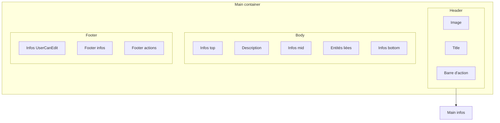

## Vues d’entités (Large / Compact / Minimal / Texte)

### Objectif

Standardiser l’affichage des entités (ressources, items, monstres, sorts, etc.) afin d’obtenir des “cards” cohérentes dans les modales et les listes, et limiter la duplication de logique.

### Méthode de description (sections)

On décrit une vue d’entité comme une **structure fixe en 3 sections** :
- **Header** (identité + actions + infos principales)
- **Body** (contenu et infos “secondaires”)
- **Footer** (métadonnées et actions de formulaire)

Puis on rattache les champs à des **sous-sections** normalisées (`main_info`, `info_top`, `info_mid`, `info_bottom`, `info_user_can_edit`, etc.).

### Schéma (architecture) — Mermaid

Ce schéma reprend le découpage “Main container → Header/Body/Footer” et les sous-zones :

### Sections & propriétés (contrat UI)

| Section | Rôle | Layout (guideline) | Responsive | Permissions | Notes |
|---|---|---|---|---|---|
| **Main container** | Card globale | `flex-col`, `gap`, `w-full` | Large/Compact prennent la place max ; Minimal peut être `auto` ou largeur fixée | n/a | Certaines propriétés peuvent influencer la couleur (ex: élément/type → ombre/contour) |
| **Header** | Identité | `flex`, `items-start`, `justify-between`, `gap` | si largeur > ~200px : image ≈ 1/3 ; sinon elle se réduit | n/a | Le **dot usable** est positionné en haut à gauche (très discret) |
| **Header/Image** | Image carrée | conteneur carré, centré, fond transparent | s’adapte à la place | n/a | Interactions image (zoom/crop/rotate) : futur (admin vs non-admin) |
| **Header/Barre d’action** | Actions contextuelles | icônes + tooltip, align top-right | si manque de place : bascule en menu (jusqu’à “tout sauf fermer”) | selon permissions + contexte | “Fermer” reste l’action toujours dispo en modal |
| **Header/Title** | Titre | multi-lignes sauf Minimal compacted | Minimal compacted : 1 ligne tronquée | n/a | texte légèrement plus grand |
| **Header/Main infos** | Infos essentielles | badges/valeurs sur 1+ lignes (ou colonnes) | en Minimal compacted : 1–2 lignes max | champs filtrés via `visibleIf(ctx)` | ne pas cacher ces infos (même en minimal compacted) |
| **Body** | Contenu | `space-y` / sections | Minimal compacted : body visible **au hover** uniquement | champs filtrés via `visibleIf(ctx)` | |
| **Body/Infos top** | Importantes non essentielles | `flex-wrap` / liste | dépend de la place | idem | |
| **Body/Description** | Gros texte | bloc | dépend de la place | idem | peut contenir effects/infographies |
| **Body/Infos mid** | Moyenne importance | liste / grid | dépend de la place | idem | |
| **Body/Entités liées** | Liens vers entités | listes (vertical/horizontal/mixtes) | en petite taille : linked en minimal compact ou “texte” | idem | rendu au cas par cas |
| **Body/Infos bottom** | Peu important | souvent absent | dépend de la place | idem | rarement utilisé |
| **Footer** | Bas de card | `flex`, `justify-between` | Minimal compacted : footer masqué (même étendu) | selon permissions | |
| **Footer/Infos UserCanEdit** | Métadonnées (id/dates) | inline | n/a | `canEdit`/`admin` | |
| **Footer/Footer infos** | Feedback live | inline | n/a | n/a | ex: dirty, erreurs, etc |
| **Footer/Footer actions** | Boutons formulaire | boutons (annuler/enregistrer) | n/a | `canEdit` | pas applicable hors édition |

### Règles “Large / Compact / Minimal” (affichage des propriétés)

#### Large

- Afficher **Icône (si dispo) + Nom de propriété + Valeur**.
- Le helper peut être affiché **en dur** (discret, style commentaire) si vraiment nécessaire, sinon tooltip.

#### Compact

- Afficher **juste la valeur** si le reste n’est pas nécessaire.
- Sinon : **icône** et/ou **abréviation** (label court).

#### Minimal

- Afficher **juste la valeur** si le reste n’est pas nécessaire.
- Sinon : priorité à **l’icône**, et seulement si besoin une **abréviation**.

### Comportement Minimal : “compacted / extended”

La vue **Minimal** est la seule pouvant être **limitée en hauteur**.

- **Minimal compacted (hauteur limitée)** :
  - Title + actions sur la même ligne, actions en **menu**.
  - Title : **1 ligne**, tronquée.
  - Main infos : **1 à 2 lignes** max.
  - **Body** et **Footer** masqués, affichage **au hover** uniquement (extended).

- **Minimal extended (au hover)** :
  - Body visible.
  - Footer reste masqué (contrat actuel).

#### API UI recommandée : `displayMode` (compact / hover / extended)

Pour éviter les ambiguïtés (et les “double hover” quand une Minimal est affichée dans une Vue Texte), on distingue le **format** (Minimal) de son **mode d’affichage** :

- **`displayMode: "hover"`** *(défaut)* : comportement actuel “compacted → extended au hover”.
- **`displayMode: "compact"`** : toujours compact, **jamais** d’extended (utile pour des listes très denses).
- **`displayMode: "extended"`** : toujours extended (utile quand on veut “la Minimal complète” sans interaction).

### Vue Texte (4ᵉ format officiel)

La **Vue Texte** est un format très compact, destiné aux listes d’entités liées ou aux affichages “inline”.

- **Structure** :
  - **Image (miniature)** à gauche (carrée, fond transparent).
  - **Nom** à droite (texte, tronqué si besoin).
- **Hover** :
  - Au survol, on affiche une **Vue Minimal** (comportement “hover card”).
  - Par défaut, on affiche **directement la Minimal en `displayMode: "extended"`** (pour éviter de devoir re-hover la card).

> En pratique, la Vue Texte sert souvent de “représentation compacte” et délègue l’information au hover.

### Quand utiliser quelle vue ? (guide rapide)

| Vue | Usage principal | Densité | Interactions | Lien avec les autres vues |
|---|---|---:|---|---|
| **Texte** | Représentation “inline” (ex: entités liées, listes compactes) | Très faible | Hover | **Hover → Minimal** |
| **Minimal** | Aperçu rapide / cartes petites / hover card | Faible | Hover (si compacted) | Peut servir de détail pour **Texte** |
| **Compact** | Card standard quand on a un peu de place | Moyenne | Actions + lecture rapide | Souvent “par défaut” en liste |
| **Large** | Lecture détaillée / contexte confortable (modal/page) | Élevée | Actions + détails | Référence la plus explicite (labels) |

### Où placer un champ ? (decision tree)

Utilise ces règles dans l’ordre :

1) **Est-ce une méta d’édition / technique / admin ?**
- Oui → **Footer/Infos UserCanEdit** (ou caché si non pertinent)

2) **Est-ce une info “qui décrit le mieux l’entité” ?**
- Oui → **Header/Main infos** (même en Minimal compacted)

3) **Est-ce important mais pas essentiel ?**
- Oui → **Body/Infos top**

4) **Est-ce du texte long / contenu narratif / effects / infographie ?**
- Oui → **Body/Description**

5) **Est-ce une info secondaire, utile mais pas prioritaire ?**
- Oui → **Body/Infos mid**

6) **Est-ce rarement utile / faible priorité ?**
- Oui → **Body/Infos bottom**

7) **Est-ce un lien vers d’autres entités (relations) ?**
- Oui → **Body/Entités liées**

> Cas spécial : `usable` s’affiche plutôt en **dot** (indicateur discret) + tooltip.

### Tailles & responsive (contrats)

- **Large / Compact**
  - Prennent la place maximale disponible.
  - On peut calculer une taille de référence commune (`xs/sm/md/lg/xl`) pour dimensionner les sous-éléments.

- **Minimal**
  - Peut être `auto` (prend la place max) ou **largeur fixée** (`xs/sm/md/lg/xl`).
  - C’est la seule vue pouvant être **limitée en hauteur** (mode compacted).

#### Règles clés (Minimal compacted)

- **Title** : 1 ligne tronquée
- **Actions** : menu (dropdown)
- **Main infos** : 1–2 lignes max
- **Body** : masqué, visible au hover (extended)
- **Footer** : masqué (même extended)

### Liens entre vues (navigation UI)

- **Texte → Minimal (hover)** : la Vue Texte n’essaie pas d’être exhaustive ; elle “délègue” les détails à la Vue Minimal au survol.
- **Minimal → Compact/Large** : la Vue Minimal doit rester cohérente avec les champs mis en avant en Compact/Large (mêmes “Main infos”, simplement plus condensés).
- **Large comme référence** : quand un doute existe sur un champ (label/helper), on se cale sur la Large qui est la plus explicite.

### Entités liées (relations) : règles d’affichage

Dans **Body/Entités liées** :
- Si on a de la place : afficher les entités liées en **Minimal** (ou Compact si très pertinent).
- Si on manque de place (minimal/compact petit) : afficher les entités liées en **Vue Texte**.
- Le layout (liste verticale, horizontale, mixte) dépend :
  - du **nombre** d’entités liées,
  - de la **diversité** (types différents),
  - de la **priorité** fonctionnelle (ex: items d’une panoplie vs “liens secondaires”).

### FAQ (référence pour créer les vues)

- **Quelle vue choisir (Texte / Minimal / Compact / Large) ?**
  - **Texte** : inline (entités liées, listes compactes), détail via **hover → Minimal**
  - **Minimal** : aperçu rapide / hover card (faible densité)
  - **Compact** : vue “standard” quand on a un peu de place (bonne densité)
  - **Large** : lecture détaillée (labels explicites, helpers)

- **Quelle structure respecter ?**
  - Toujours **Main container → Header / Body / Footer** (mêmes sections pour toutes les entités).

- **Où placer une propriété ?**
  - **Décrit le mieux l’entité** → `Header/Main infos`
  - **Important mais non essentiel** → `Body/Infos top`
  - **Texte long** → `Body/Description`
  - **Secondaire** → `Body/Infos mid`
  - **Faible priorité** → `Body/Infos bottom`
  - **Admin/édition (id/dates/flags)** → `Footer/Infos UserCanEdit`
  - **Relations** → `Body/Entités liées`

- **Qu’est-ce qui doit rester visible en Minimal compacted ?**
  - `Title` (1 ligne tronquée) + actions en menu + `Main infos` (1–2 lignes max).  
  - `Body` visible au hover uniquement ; `Footer` masqué (même extended).

- **Comment afficher la même info selon la vue ?**
  - **Large** : **Icône + Nom + Valeur** (helper possible, sinon tooltip)
  - **Compact** : valeur seule si possible ; sinon **icône + abrégé + valeur**
  - **Minimal** : valeur seule si possible ; sinon **icône** (abrégé seulement si nécessaire)

- **Dois-je répéter le nom de la propriété “type” ?**
  - **Compact/Minimal** : généralement non (la valeur suffit).  
  - **Large** : oui si utile (explicite).

- **Comment afficher `usable` ?**
  - Plutôt un **dot discret** (success/error) + tooltip **“Adapté au JDR / Non adapté au JDR”** (pas une colonne bruyante).

- **Comment gérer les permissions ?**
  - Filtrer via `desc.permissions.visibleIf(ctx)` **avant** d’afficher/placer le champ.

- **Comment afficher les entités liées ?**
  - Si place suffisante : afficher en **Minimal** (ou Compact si très pertinent).  
  - Si place faible : afficher en **Vue Texte** (hover → Minimal).

- **Si une propriété peut aller dans plusieurs sections, je fais quoi ?**
  - Priorité à `Header/Main infos` si c’est **essentiel** ou si la place est limitée.
  - Sinon, on peut la mettre dans `Body/Infos top` (ou `Infos mid`) pour éviter de surcharger le header.

- **Que faire si l’icône / label / tooltip n’existe pas dans les descriptors ?**
  - Fallback acceptable (icône générique + label auto), mais la bonne solution est **d’ajouter** `general.icon` / `general.label` / `general.tooltip` dans le descriptor.

- **Responsive de l’image (>200px ≈ 1/3), comment l’appliquer ?**
  - Si la vue a assez de largeur (≈ > 200px), l’image peut prendre ~1/3 de la largeur.
  - Sinon, l’image se **réduit** et laisse la priorité au titre + actions + main infos.

- **Badge vs texte vs icône-only : comment décider ?**
  - Large : **icône + label + valeur**, badge si ça apporte de la lisibilité.
  - Compact : badge/texte selon lisibilité, mais éviter la verbosité.
  - Minimal : **icône-only** dès que possible (valeur en tooltip).

- **Champs admin-only : je laisse un placeholder si l’utilisateur n’a pas accès ?**
  - Non : si `visibleIf(ctx)` est false, le champ ne doit **pas** réserver d’espace (la vue doit se compacter naturellement).

### Tableau de référence (propriétés → sections / vues)

Ce tableau sert de **source de vérité** pour guider le placement des propriétés et leur rendu selon la vue.  
(Historique : initialement rédigé dans `docs/110- To Do/Description vues Entity.md`.)

**Légende “Priorité” (indicative)** : \(0\) = technique/admin, \(6\) = essentiel (à garder visible en `Header/Main infos` quand c’est applicable).  

| Propriété                                                                                      | Section préférable                  | Priorité | Icone | Nom                                                     | Abrégé                                | Vue Minimal | Vue Compact | Vue Large | Condition | Permission |
| ---------------------------------------------------------------------------------------------- | ----------------------------------- | -------- | ----- | ------------------------------------------------------- | ------------------------------------- | ----------- | ----------- | --------- | --------- | ---------- |
| usable                                                                                         | Sous forme de dot en haut à gauche  | 5        | v     | Adapté                                                  |                                       | V           | V           | N + V     | all        |
| is_visible                                                                                     | info_user_can_edit                  | 3        | -     | Visible par                                             | -                                     | -           | N + V       | N + V     |           | canEdit    |
| created_by                                                                                     | info_user_can_edit                  | 1        | -     | Créé par                                                | -                                     | -           | N + V       | N + V     |           | canEdit    |
| created_at                                                                                     | info_user_can_edit                  | 1        | -     | Créé le                                                 | -                                     | -           | N + V       | N + V     |           | canEdit    |
| updated_at                                                                                     | info_user_can_edit                  | 2        | -     | Mis à jour le                                           | -                                     | -           | N + V       | N + V     |           | canEdit    |
| dofus_version                                                                                  | info_user_can_edit                  | 0        | -     | Version                                                 |                                       | -           | N + V       | N + V     |           | admin      |
| auto_update                                                                                    | info_user_can_edit                  | 2        | -     | Mise à jour automatique depuis des sources externes     | Maj Auto                              | -           | A + V       | A + V     |           | admin      |
| official_id                                                                                    | info_user_can_edit                  | 0        | -     |                                                         | -                                     | -           | N + V       | N + V     |           | admin      |
| dofusdb_id                                                                                     | info_user_can_edit                  | 0        | -     |                                                         | -                                     | -           | N + V       | N + V     |           | admin      |
| id                                                                                             | info_user_can_edit                  | 2        | -     |                                                         | -                                     | -           | N + V       | N + V     |           | canEdit    |
| state                                                                                          | main_info                           | 3        | -     | Etat                                                    | -                                     | N + V       | N + V       | N + V     |           | all        |
| is_public                                                                                      | main_info                           | 2        | -     | -                                                       | -                                     | V           | V           | V         |           | canEdit    |
| level                                                                                          | main_info                           | 6        | v     | Niveau                                                  | nvx                                   |             |             |           |           | all        |
| pa, po, pm                                                                                     | main_info, info_top              | 5        | v     | Points de ...                                           | PA, PM ou PO                          | I + V       | I  + A+ V   | I + N +V  |           | all        |
| po_editable                                                                                    | main_info, info_top              | 4        | v     | Portée modifiable                                       | PO modif                              | I + V       | I + V       | I + A +V  |           | all        |
| time_before_use_again                                                                          | main_info, info_top              | 2        | v     |                                                         |                                       | I + V       | I + V       | I + N +V  |           | all        |
| castng_time                                                                                    | main_info, info_top              | 2        | v     |                                                         |                                       | I + V       | I + V       | I + N +V  |           | all        |
| duration                                                                                       | main_info, info_top              | 4        | v     |                                                         |                                       | I + V       | I + V       | I + N +V  |           | all        |
| cast_per_turn                                                                                  | main_info, info_top              | 2        | v     |                                                         |                                       | I + V       | I+V         | I + N + V |           | all        |
| cast_per_target                                                                                | main_info, info_top              | 2        | v     |                                                         |                                       | I + V       | I+V         | I + N + V |           | all        |
| sight_line                                                                                     | main_info, info_top              | 3        | v     |                                                         |                                       | I + V       | I+V         | I + N + V |           | all        |
| number_between_two_cast                                                                        | main_info, info_top              | 2        | v     |                                                         |                                       | I + V       | I+V         | I + N + V |           | all        |
| number_between_cast_editable                                                                   | main_info, info_top              | 2        | v     |                                                         |                                       | I + V       | I+V         | I + N + V |           | all        |
| area                                                                                           | main_info, info_top              | 3        | v     |                                                         |                                       | I + V       | I+V         | I + N + V |           | all        |
| is_magic                                                                                       | main_info, info_top              | 4        | v     |                                                         |                                       | I + V       | I + N +V    | I + N +V  |           | all        |
| ritual_available                                                                               | main_info, info_top              | 2        | v     |                                                         |                                       | I + V       | I + N +V    | I + N +V  |           | all        |
| powerfull                                                                                      | main_info, info_top              | 2        | v     |                                                         |                                       | I + V       | I + N +V    | I + N +V  |           | all        |
| life                                                                                           | main_info, info_top              | 4        | v     | Vie                                                     | -                                     |             |             |           |           | all        |
| life_dice                                                                                      | main_info, info_top              | 5        | v     | Valeur du Dé de vie                                     | Dé de vie                             | I  + V      | I  + V      | I + A + V |           | all        |
| price / kamas                                                                                  | info_top, info_mid               | 1        | v     | Prix                                                    | -                                     | I-V         | I+V         | I + N + V |           | all        |
| rarity                                                                                         | main_info                           | 3        | -     | Rareté                                                  | -                                     | V           | V           | N + V     |           | all        |
| type_...                                                                                       | main_info                           | 5        | -     | Type de ...                                             | -                                     | V           | V           | N + V     |           | all        |
| is_boss                                                                                        | main_info                           | 4        | v     | Boss                                                    | -                                     | V           | V           | N + V     | afficher que si boss | all        |
| size                                                                                           | main_info                           | 5        | -     | Taille                                                  | ⸱                                     | V           | V           | N + V     |           | all        |
| boss_pa                                                                                        | main_info                           | 4        | v     | PA suplémentaire                                        | PA sup                                | I + V       | I + A + V   | I + N + V | afficher que si boss | all        |
| weight                                                                                         | info_top, info_mid               | 2        | v     | Poids                                                   | -                                     | I + V       | I + V       | I + N + V |           | all        |
| hostility                                                                                      | main_info, info_top, info_mid | 4        | -     | Aggressivité                                            | -                                     | V           | V           | N + V     |           | all        |
| ini                                                                                            | info_top, info_mid               | 4        | v     | Initiative                                              | Ini                                   | I + V       | I + A + V   | I + N + V |           | all        |
| invocation                                                                                     | main_info, info_top, info_mid | 4        | v     | Invocation                                              | Invoc                                 | I + V       | I + A + V   | I + N + V |           | all        |
| touch                                                                                          | main_info, info_top, info_mid | 3        | v     | Bonus de touche                                         | Touche                                | I + V       | I + A + V   | I + N + V |           | all        |
| ca                                                                                             | main_info, info_top, info_mid | 3        | v     | Classe d'armure                                         | CA                                    | I + V       | I + A + V   | I + N + V |           | all        |
| dodge_ pa ou pm                                                                                | info_top, info_mid               | 2        | v     | Esquive PM, PA                                          | -                                     | I + V       | I + V       | I + N + V |           | all        |
| fuite / tacle                                                                                  | info_top, info_mid               | 2        | v     | Fuite, Tacle                                            | -                                     | I + V       | I + V       | I + N + V |           | all        |
| vitality / sagesse / strong / intel / agi / chance                                             | info_top                             | 5        | v     | Vitalité, Sagesse, Force, Agilité, Chance, Intelligence | Vita, Sasa, Force, Agi, Chance, Intel | I + V       | I + V       | I + N + V |           | all        |
| do_fixe_ ...                                                                                   | info_top, info_mid                | 3        | v     | Dommage fixe                                            | Do fixe                               | I + V       | I + A + V   | I + N + V |           | all        |
| res_                                                                                           | info_top, info_mid                | 3        | v     | Résistance, résistance fixe                             | Res, Res fixe                         | I + V       | I + A + V   | I + N + V |           | all        |
| bonus de compétence (acrobatie_bonus, ...) Maitrise de compétence (acrobatie_mastery) | info_mid, info_bottom            | 1        | v     | Nom de la compétence                                    | -                                     | N + V       | N + V       | N + V     |           | all        |
|                                                                                                |                                     |          |       |                                                         |                                       |             |             |           |           |            |

N : nom ou A : Abrégé  
V : Valeur  
I : Icone  
Ex : N + V = nom + valeur  

### Contrats de données (source de vérité)

- **Valeur affichée** : provient de `entity.toCell(fieldKey, …)` (pas de logique métier “au hasard” dans la vue).
- **Libellé / icône / tooltip** : proviennent des **descriptors** (`general.label`, `general.icon`, `general.tooltip`, …).
- **Visibilité** : vient de `desc.permissions.visibleIf(ctx)` ; si false, le champ ne doit pas réserver d’espace.
- **Choix de rendu (Large/Compact/Minimal)** : suit le contrat de cette doc (icône/label/abrégé), et non des règles ad-hoc par entité.

### Kit commun (Atoms / Molecules) pour implémenter les vues

Ces composants sont à privilégier pour éviter la duplication et aider la génération des vues :

- **Molecule — Vue Texte générique**
  - `resources/js/Pages/Molecules/entity/shared/EntityViewTextLink.vue`
  - Rôle : implémente la **Vue Texte officielle** (inline), avec **hover → Vue Minimal**.
  - Usage : toutes les `*ViewText.vue` doivent déléguer à ce composant.

- **Molecule — Header commun**
  - `resources/js/Pages/Molecules/entity/shared/EntityViewHeader.vue`
  - Rôle : standardise le **Header** (image + title + actions + main infos) selon le mode `large/compact/minimal`.
  - Usage : les `*ViewLarge.vue` et `*ViewCompact.vue` doivent l’utiliser pour éviter la duplication de structure.
  - Slots utiles :
    - `dot` : indicateur discret en **haut-gauche** (ex : `EntityUsableDot`).
    - `mainInfosRight` : pour les metas en **minimal** (icônes à droite du titre).

- **Atom — Indicateur usable**
  - `resources/js/Pages/Atoms/data-display/EntityUsableDot.vue`
  - Rôle : petit dot discret (success/error) + tooltip **“Adapté au JDR / Non adapté au JDR”**.
  - Usage : tableau (ligne), header de vue, liste, etc.
  - Pattern recommandé (dans un `EntityViewHeader`) :
    - Placer dans le slot `dot` avec un wrapper `absolute -top-3 -left-3`.

- **Helper UI partagé**
  - `resources/js/Utils/Entity/entity-view-ui.js`
  - Rôle : centraliser label/icône/tooltip + conversions de cell (ex: éviter les badges imbriqués).

- **Résolution dynamique des vues**
  - `resources/js/Utils/entity/resolveEntityViewComponent.js`
  - Rôle : charger dynamiquement la vue d’entité (large/compact/minimal/text).

### Principes

- **Header**
  - **Image à gauche** (si disponible), sinon **icône fallback**.
  - **Nom à droite** (titre).
  - **Actions** en haut à droite (au plus proche du bouton fermer du panel).
  - **Close** : en modal, le bouton “fermer” doit être **dans le même groupe visuel** que les autres actions (continuité, pas d’élément flottant).
  - **Overlays sur image** :
    - `usable` : dot discret en haut-gauche de l’image.
    - `level` : badge discret en haut-droite de l’image.
    - Au **hover** de l’image : masquer ces overlays pour laisser l’image “respirer”.
    - Au **hover** de l’image : afficher l’image en `object-contain` (non crop) si la vue utilise un rendu “cover” par défaut.
    - **Zone hover** : éviter de déclencher le hover sur le haut de l’image (garder ~20% “safe”) pour laisser accessibles les tooltips des overlays.
    - **Alignement** : `usable` (dot) et `level` (badge) doivent être alignés sur la même “ligne” (même offset `top`), à gauche/droite.

- **Infos importantes (metas)**
  - Se référer au découpage par sections (**Main infos** en header, puis **Infos top/mid/bottom** dans le body).
  - **Badge vs texte** :
    - Les metas “importantes” peuvent être stylisées, mais éviter le “tout en badge”.
    - Pattern recommandé : **icône + label en texte inline**, et **valeur seule** dans un `Badge` (meilleure lisibilité, pas de bug visuel).
    - Les infos “techniques” (IDs, dates, audit) doivent être plutôt en **texte** (phrase / liste), pas en badges.

- **Libellés**
  - On explicite le nom de la propriété surtout en **Large**.
  - En **Compact/Minimal**, on évite les labels si la valeur est compréhensible (ex: `type`).
- Abréviations recommandées (ex: `level` → **nvx**).

- **Helpers / tooltips**
  - Les helpers viennent principalement des descriptors :
    - `display.tooltip` (si présent)
    - `table.header.tooltip`
    - `general.tooltip`
    - fallback: `edition.form.help`
  - Par défaut: affichage au **survol**. Inline uniquement si vraiment pertinent (exception).

### Descriptors-driven

Les vues utilisent les descriptors comme source de vérité UI :
- **Label**: `desc.general.label`
- **Icône**: `desc.general.icon`
- **Visibilité**: `desc.permissions.visibleIf(ctx)`
- **Tooltip**: voir section précédente

### Implémentation (helpers)

Les helpers de rendu sont centralisés dans :
- `resources/js/Utils/Entity/entity-view-ui.js`

Et une règle Cursor de référence existe :
- `.cursor/rules/entity-views.mdc`

### Exemple complet — Resource (référence)

Cet exemple sert de **modèle** pour implémenter les autres entités.

#### Fichiers (source de vérité UI)

- **Descriptors** : `resources/js/Entities/resource/resource-descriptors.js`
- **Vues** :
  - `resources/js/Pages/Molecules/entity/resource/ResourceViewLarge.vue`
  - `resources/js/Pages/Molecules/entity/resource/ResourceViewCompact.vue`
  - `resources/js/Pages/Molecules/entity/resource/ResourceViewMinimal.vue`
  - `resources/js/Pages/Molecules/entity/resource/ResourceViewText.vue`

#### Mapping “sections → champs”

- **Header/Image** : `image` (thumb)
- **Header/Title** : `name`
- **Header/Main infos** (essentielles) :
  - `resource_type`
  - `level`
  - `rarity`
- **Header/usable** :
  - **dot uniquement** sur l’image (discret, haut-gauche)
  - pas de badge/colonne “usable” dans les metas (éviter le bruit visuel)
- **Header/level** :
  - En **Large**, `level` reste aussi dans **Header/Main infos** (source principale).
  - Optionnel : valeur affichée en **badge discret** sur l’image (haut-droit) pour un repère visuel rapide.
  - au hover de l’image : on masque le badge (et le dot usable) pour laisser l’image ressortir
- **Body/Description** :
  - Large : `description` (en `subtitle` sous le header)
  - Minimal : le body est visible au hover (extended), selon le contrat
- **Body/Infos mid (au hover en Minimal)** :
  - `price`
  - `weight`
- **Footer/Infos UserCanEdit (paramètres)** :
  - `dofus_version`
  - `auto_update`
  - `is_visible`
- **Footer / infos techniques** :
  - Large : `dofusdb_id`, `official_id`, `created_by`, `created_at`, `updated_at` (si `visibleIf(ctx)` le permet)

#### Structure attendue par vue

- **Large**
  - Header : image à gauche, nom à droite, actions en haut à droite, metas en badges sous le titre, description en dessous.
  - Infos techniques : badges “outline” séparés (zone secondaire).
- **Compact**
  - Header : image + nom + actions, metas en badges sous le titre.
- **Minimal**
  - Header : image + titre, metas **en icônes** à droite (slot `mainInfosRight`), actions en menu.
  - Body : visible uniquement au hover (extended).
- **Texte**
  - Délègue à `EntityViewTextLink` : inline, hover → `ResourceViewMinimal`.
