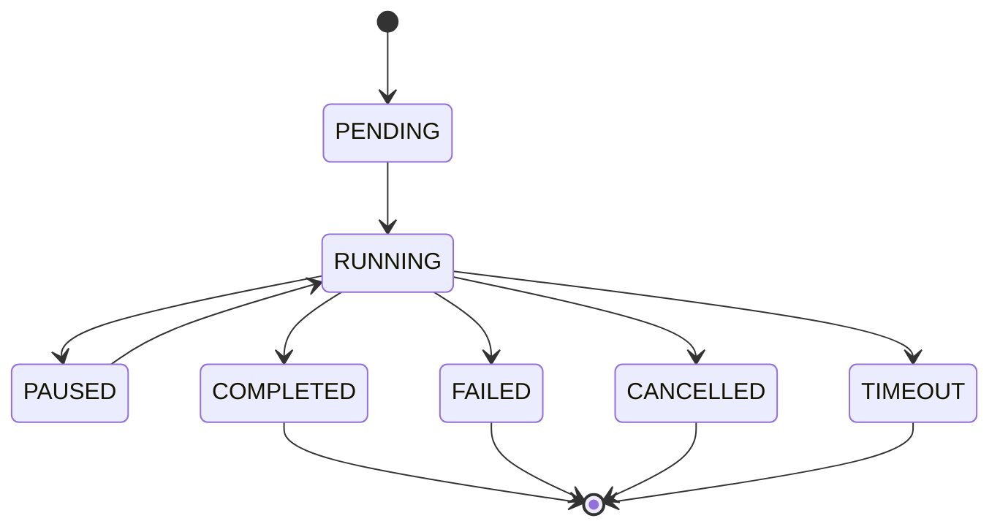

# Définitions de l'Orchestrateur de Scrapping

## 📋 Vue d'ensemble

Ce document définit les structures de données, les règles d'orchestration et les processus de coordination que l'orchestrateur utilise pour gérer le flux de données entre les services de scrapping.

## 🏗️ Architecture des processus

### **Types de processus d'import**

#### **Processus d'import individuel**
```json
{
  "process_id": "uuid-v4",
  "type": "individual",
  "entity_type": "class",
  "dofusdb_id": 123,
  "status": "running",
  "progress": 0.75,
  "started_at": "2025-01-15T10:00:00Z",
  "estimated_completion": "2025-01-15T10:05:00Z",
  "current_step": "conversion",
  "steps_completed": ["collection", "translation"],
  "steps_remaining": ["conversion", "integration", "saving"]
}
```

#### **Processus d'import en lot**
```json
{
  "process_id": "uuid-v4",
  "type": "batch",
  "entities": [
    {"type": "class", "id": 1, "status": "completed"},
    {"type": "class", "id": 2, "status": "running"},
    {"type": "monster", "id": 100, "status": "pending"}
  ],
  "total_entities": 3,
  "completed_entities": 1,
  "failed_entities": 0,
  "overall_progress": 0.33,
  "status": "running",
  "started_at": "2025-01-15T10:00:00Z",
  "parallel_processing": true,
  "max_concurrent": 3
}
```

#### **Processus d'import par catégorie**
```json
{
  "process_id": "uuid-v4",
  "type": "category",
  "category": "classes",
  "total_entities": 15,
  "processed_entities": 8,
  "failed_entities": 1,
  "progress": 0.53,
  "status": "running",
  "started_at": "2025-01-15T10:00:00Z",
  "batch_size": 5,
  "current_batch": 2
}
```

## 🔄 États des processus

### **Cycle de vie d'un processus**

#### **États possibles**
```php
enum ProcessStatus: string
{
    case PENDING = 'pending';        // En attente d'exécution
    case RUNNING = 'running';        // En cours d'exécution
    case PAUSED = 'paused';         // Mis en pause
    case COMPLETED = 'completed';    // Terminé avec succès
    case FAILED = 'failed';         // Terminé avec erreur
    case CANCELLED = 'cancelled';   // Annulé par l'utilisateur
    case TIMEOUT = 'timeout';       // Expiré par timeout
}
```

#### **Transitions d'état**


### **Gestion des étapes**

#### **Étapes d'un processus d'import**
```php
enum ProcessStep: string
{
    case VALIDATION = 'validation';           // Validation des paramètres
    case TRANSLATION = 'translation';         // Traduction KrosmozJDR → DofusDB
    case COLLECTION = 'collection';           // Récupération des données
    case RESTRUCTURING = 'restructuring';     // Restructuration des données
    case CONVERSION = 'conversion';           // Conversion des valeurs
    case INTEGRATION = 'integration';         // Intégration en base
    case SAVING = 'saving';                   // Sauvegarde finale
    case CLEANUP = 'cleanup';                 // Nettoyage des ressources
}
```

#### **Progression des étapes**
```json
{
  "step_progress": {
    "validation": {"status": "completed", "duration": 0.1, "errors": []},
    "translation": {"status": "completed", "duration": 0.2, "errors": []},
    "collection": {"status": "completed", "duration": 2.5, "errors": []},
    "restructuring": {"status": "completed", "duration": 0.8, "errors": []},
    "conversion": {"status": "running", "progress": 0.6, "duration": 1.2, "errors": []},
    "integration": {"status": "pending", "progress": 0.0, "duration": 0.0, "errors": []},
    "saving": {"status": "pending", "progress": 0.0, "duration": 0.0, "errors": []},
    "cleanup": {"status": "pending", "progress": 0.0, "duration": 0.0, "errors": []}
  }
}
```

## 📊 Métriques et monitoring

### **Métriques de performance**

#### **Métriques temporelles**
```json
{
  "time_metrics": {
    "total_duration": 15.2,
    "average_step_duration": 1.9,
    "fastest_step": "validation",
    "slowest_step": "collection",
    "bottleneck_step": "conversion",
    "efficiency_score": 0.87
  }
}
```

#### **Métriques de ressources**
```json
{
  "resource_metrics": {
    "memory_peak": 256.5,
    "memory_average": 128.3,
    "cpu_usage_peak": 85.2,
    "cpu_usage_average": 45.8,
    "network_requests": 12,
    "network_data_transferred": 2048.5
  }
}
```

#### **Métriques de qualité**
```json
{
  "quality_metrics": {
    "entities_processed": 150,
    "entities_successful": 148,
    "entities_failed": 2,
    "success_rate": 0.987,
    "validation_errors": 1,
    "conversion_errors": 1,
    "integration_errors": 0
  }
}
```

### **Alertes et seuils**

#### **Configuration des seuils**
```php
'alert_thresholds' => [
    'process_timeout' => 3600,        // 1 heure
    'memory_limit' => 1024,           // 1 GB
    'cpu_limit' => 90,                // 90%
    'error_rate_threshold' => 0.05,   // 5%
    'success_rate_minimum' => 0.95,   // 95%
    'step_duration_max' => 300,       // 5 minutes par étape
];
```

## 🚨 Gestion des erreurs

### **Types d'erreurs**

#### **Erreurs de validation**
```json
{
  "error_type": "validation",
  "error_code": "INVALID_DOFUSDB_ID",
  "message": "L'ID DofusDB fourni n'est pas valide",
  "details": {
    "provided_id": "abc",
    "expected_format": "integer",
    "field": "dofusdb_id"
  },
  "severity": "error",
  "recoverable": false
}
```

#### **Erreurs de collection**
```json
{
  "error_type": "collection",
  "error_code": "DOFUSDB_UNAVAILABLE",
  "message": "Le service DofusDB n'est pas accessible",
  "details": {
    "url": "https://api.dofusdb.fr",
    "status_code": 503,
    "response_time": 30.5
  },
  "severity": "error",
  "recoverable": true,
  "retry_attempts": 3,
  "retry_delay": 60
}
```

#### **Erreurs de conversion**
```json
{
  "error_type": "conversion",
  "error_code": "VALUE_OUT_OF_RANGE",
  "message": "La valeur convertie dépasse les limites autorisées",
  "details": {
    "characteristic": "life",
    "original_value": 5000,
    "converted_value": 5000,
    "min_limit": 1,
    "max_limit": 1000,
    "entity_type": "class",
    "entity_id": 123
  },
  "severity": "warning",
  "recoverable": true,
  "fallback_value": 1000
}
```

### **Stratégies de récupération**

#### **Retry automatique**
```php
'retry_strategies' => [
    'collection_errors' => [
        'max_attempts' => 3,
        'backoff_multiplier' => 2,
        'initial_delay' => 5,
        'max_delay' => 60
    ],
    'conversion_errors' => [
        'max_attempts' => 2,
        'backoff_multiplier' => 1.5,
        'initial_delay' => 1,
        'max_delay' => 10
    ],
    'integration_errors' => [
        'max_attempts' => 3,
        'backoff_multiplier' => 2,
        'initial_delay' => 10,
        'max_delay' => 120
    ]
];
```

#### **Fallback et valeurs par défaut**
```php
'fallback_strategies' => [
    'value_out_of_range' => 'use_limit',
    'missing_required_field' => 'use_default',
    'invalid_format' => 'skip_entity',
    'service_unavailable' => 'retry_later',
    'database_error' => 'rollback_and_retry'
];
```

## 🔧 Configuration des processus

### **Paramètres de processus**

#### **Configuration des timeouts**
```php
'process_timeouts' => [
    'individual_import' => [
        'total_timeout' => 1800,      // 30 minutes
        'step_timeout' => 300,        // 5 minutes par étape
        'collection_timeout' => 600,  // 10 minutes pour la collection
        'conversion_timeout' => 300,  // 5 minutes pour la conversion
        'integration_timeout' => 600  // 10 minutes pour l'intégration
    ],
    'batch_import' => [
        'total_timeout' => 7200,      // 2 heures
        'entity_timeout' => 600,      // 10 minutes par entité
        'batch_timeout' => 1800       // 30 minutes par lot
    ],
    'category_import' => [
        'total_timeout' => 14400,     // 4 heures
        'batch_timeout' => 3600,      // 1 heure par lot
        'entity_timeout' => 300       // 5 minutes par entité
    ]
];
```

#### **Configuration de la concurrence**
```php
'concurrency_settings' => [
    'max_concurrent_processes' => 3,
    'max_concurrent_entities' => 5,
    'max_concurrent_batches' => 2,
    'resource_limits' => [
        'memory_per_process' => 512,  // MB
        'cpu_per_process' => 50,      // %
        'network_connections' => 10
    ]
];
```

## 📝 Logs et traçabilité

### **Structure des logs**

#### **Log de processus**
```json
{
  "timestamp": "2025-01-15T10:00:00Z",
  "process_id": "uuid-v4",
  "level": "info",
  "message": "Début du processus d'import de classe",
  "context": {
    "entity_type": "class",
    "dofusdb_id": 123,
    "user_id": 456,
    "request_id": "req-uuid"
  },
  "metadata": {
    "service": "orchestrator",
    "version": "1.0.0",
    "environment": "production"
  }
}
```

#### **Log d'étape**
```json
{
  "timestamp": "2025-01-15T10:00:15Z",
  "process_id": "uuid-v4",
  "step": "collection",
  "level": "info",
  "message": "Étape de collection terminée avec succès",
  "context": {
    "duration": 15.2,
    "entities_collected": 1,
    "data_size": 2048
  },
  "performance": {
    "memory_usage": 128.5,
    "cpu_usage": 45.2,
    "network_requests": 3
  }
}
```

### **Corrélation des logs**

#### **Identifiants de corrélation**
```php
'correlation_ids' => [
    'process_id' => 'uuid-v4',           // Identifiant unique du processus
    'request_id' => 'req-uuid',          // Identifiant de la requête HTTP
    'user_id' => 456,                    // Identifiant de l'utilisateur
    'session_id' => 'sess-uuid',         // Identifiant de session
    'trace_id' => 'trace-uuid'           // Identifiant de traçage distribué
];
```

---

*Définitions de l'orchestrateur de scrapping - Projet KrosmozJDR*
