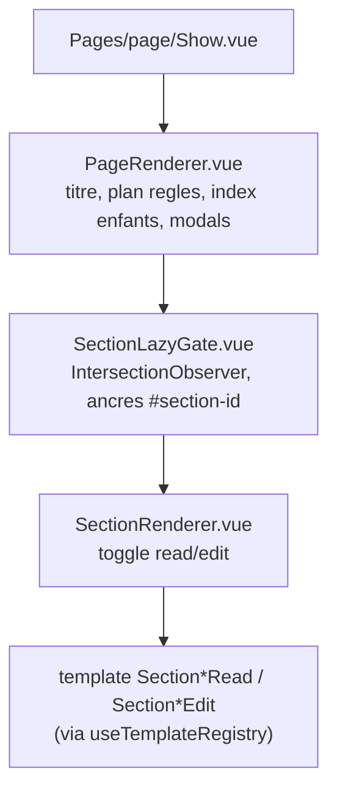

# CMS Pages & Sections

Le CMS maison gère le contenu éditorial du site (accueil, règles, bibliothèques, pages légales). Une **page** est un nœud d'un arbre hiérarchique exposé dans le menu ; elle contient des **sections** ordonnées, chacune d'un **template** typé.

## Modèle de données

### Page (`app/Models/Page.php`)

| Champ | Rôle |
| --- | --- |
| `title`, `slug` (unique) | Identité ; binding de route `{page:slug}` |
| `state`, `read_level`, `write_level` | États `raw`/`draft`/`auto`/`playable`/`archived` + droits (voir [permissions](../permissions/README.md)) |
| `parent_id` | Hiérarchie (arbre) |
| `in_menu`, `menu_order`, `menu_group`, `entity_key` | Présence et placement dans le menu |
| `icon`, `*_css_classes` | Présentation |
| `settings` (JSON) | `linked_entity {type,id}`, `menu_collapsible`, `show_rules_breadcrumb` |
| `created_by`, soft delete | Auteur, suppression logique |

Relations : `sections` (HasMany, ordonnées), `parent`/`children`, `users` (pivot `page_user`), `campaigns`, `scenarios`. Slugs critiques non supprimables : `accueil`, `cgu`. Scopes utiles : `playable()`, `inMenu()`, `readableFor($user)`, `forMenu($user)`.

### Section (`app/Models/Section.php`)

| Champ | Rôle |
| --- | --- |
| `page_id`, `order` | Rattachement et tri |
| `template` (enum `SectionType`) | Type de section (le champ `type`/`params` est legacy, miroir de `template`/`data`) |
| `data`, `settings` | Contenu et options du template |
| `state`, `read_level`, `write_level`, `created_by` | États + droits |

Médias via Spatie Media Library (collection `files`, conversions `thumb`/`webp`). Les SVG ne sont pas acceptés en upload (contenu XML exécutable). Les droits d'une section vérifient aussi ceux de la page parente.

## Templates de sections

L'enum `app/Enums/SectionType.php` définit 12 types (defaults PHP dans `config/section_templates.php`) :

| `value` | Usage |
| --- | --- |
| `text` | Texte riche (Tiptap) avec kref optionnels |
| `image`, `gallery`, `video` | Médias |
| `entity_table` | Tableau d'entités (legacy) ; bouton Créer (`CreateEntityModal`) si droit `create` |
| `legal_markdown` | Document légal en Markdown |
| `characteristic_norms`, `characteristic_norms_catalog`, `characteristic_reference_table` | Chartes/référentiels de caractéristiques |
| `equipment_bonus_table` | Plafonds de bonus d’équipement (slot × carac × bandes 1–2…19–20, prix, FM) ; projection live de `characteristic_object.formula` |
| `forgemagie_rune_table` | Prix et bonus max des runes de forgemagie ; projection live de `characteristic_object` (`forgemagie_max`, `rune_price_per_unit`) |
| `download_catalog` | Fichiers téléchargeables (livre PDF/ODT, fiches, logo) d’après `config/game_downloads.php` |

Côté front, chaque template est un dossier `resources/js/Pages/Organismes/section/templates/<type>/` avec `config.js` + `Section*Read.vue` + `Section*Edit.vue`, auto-découvert par `templates/index.js` (`import.meta.glob('./*/config.js')`) et exposé via `composables/useTemplateRegistry.js`.

## Rendu (frontend)

Largeur des sections (cadre page / fiche) : le layout et `Container fluid` occupent toute la zone utile (`w-full min-w-0`, plus de shrink-to-fit). Les sections hors tableaux font `w-full` puis `md:w-2/3` (centrées). Les templates dont le nom finit par `_table` (`entity_table`, `characteristic_reference_table`, `equipment_bonus_table`, `forgemagie_rune_table`) prennent 100 % dès le chargement. Si le contenu (tableau TanStack `width: fit-content`) dépasse, le corps de section a `overflow-x-auto`. Même règle sur `EntitySectionsRenderer`.

Chargement : `SectionContentSkeleton` (`SectionLazyGate`, `SectionRenderer`, templates async) reprend la forme du contenu (lignes de texte, média, galerie, tableau, cartes `entity_table`, fichiers, chartes). Les catalogues d’entités en vue minimale utilisent `EntityViewSkeleton` (plusieurs cartes vignette + titre), pas un seul bloc gris.

Édition : `usePageForm`/`useSectionForm` (composables `resources/js/Composables/pages|sections/`), modales `CreatePageModal`/`EditPageModal`/`CreateSectionModal`. Si `settings.linked_entity` est présent, `PageController::show` renvoie `Pages/page/LinkedEntityShow.vue` (page CMS + fiche breed/spécialisation). Les sorts, capacités et autres liaisons de cette fiche sont filtrés avec `visibleToUser` (même règle que la page Show de l’entité) : un brouillon ne fuit pas via une fiche jouable. `pages:sync-bibliotheque-entities` crée une sous-page menu (`in_menu`) pour chaque classe / spécialisation **hors archive**. Jouable : `read_level` de la fiche. Brouillon / brut / auto : `read_level` MJ+ (le menu invité ne les liste pas). Les parents `bibliotheque-breed` et `bibliotheque-specialization` ont `settings.menu_collapsible`.

## Références kref

Les « kref » sont des références inline insérées dans le texte riche.

- **Format stocké (HTML)** : `Libellé`. Types : `characteristic`, `entity`, `page`, `pageSection`.
- **Format import (Markdown/seed)** : shortcodes `[[kref:entity:spells:42|Boule de feu]]`, convertis par `app/Support/Cms/KrefShortcodeReplacer.php`.
- **Édition** : `@` dans `RichTextEditorField` (prop `enableRichReferences`) → recherche (`useRichReferenceSearch`) → nœud Tiptap `referenceInline`.
- **Sauvegarde** : `SectionService` passe le HTML dans Purifier (`section_text`) puis valide les références (`SectionRichReferencesValidator` : existence + droits Gate sur la cible).
- **Lecture** : `RichTextReadonlyView` + `RichTextKrefInteractions` (popover page/section au survol, navigation au clic). Les krefs **entité** catalogue (capacités, sorts, objets, etc.) sont rendus par `ReferenceInlineNodeView` : overlay chromeless `*ViewMinimal` (`displayMode: extended`, même contrat que `EntityViewTextLink` / recherche) via `loadKrefEntityMinimalOverlay` et `api.tables.*`. Types hors catalogue (ex. créatures) : aperçu léger `KrefEntityTooltipBody` / `api.cms.kref-entity-preview`. Codec : `resources/js/Composables/richText/krefCodec.js`.
- **API de support** : `app/Http/Controllers/Api/Cms*.php` (picker page/section, preview snippet, preview entité hors catalogue).

## Menu dynamique

`GET /pages/menu` (`PageController::menu`, réponse JSON) → composable `useDynamicMenu` (axios) → `DynamicMenu.vue` dans `Layouts/Aside.vue`. L'arbre est construit par `PageService::getMenuPages` + `buildMenuTree`, regroupé selon `config/nav_menu.php` (`groups` : L'Essentiel, Règles, Bibliothèques, Pour les MJ, Informations), avec fallback `config('nav_menu.bibliotheques')` si le groupe Bibliothèques n’a pas encore de pages seedées. Un groupe sans enfants (après filtrage `read_level`) n’est pas renvoyé. Le cache menu est invalidé via `PageService::clearMenuCache()` après tout CRUD de page.

**L’Essentiel** : aide-mémoire joueur (`database/seeders/data/essential-pages.php`), une page par sujet, chiffres alignés sur `private/game/rules`. Reseed : `php artisan db:seed --class=PageSeeder`.

**Pour les MJ** n’est pas une page CMS : c’est un groupe de menu. Il contient l’atelier **Création** (`/pages/creation`, `read_level` MJ) et le **chapitre 5** des règles (`regles-5-*`, équilibrage des entités). L’atelier Création propose une page d’aide par type d’entité. Sorts, monstres, équipements, consommables, capacités, traits et ressources suivent cinq blocs (philosophie, points importants, limites et propriétés, conseils, exemples) — source `resources/ia/creation-guides/`, aussi destinée au prompt de conversion (`php artisan ia:creation-guides`). Classes, spés, PNJ, panoplies et états restent dans `database/seeders/data/creation-pages.php`. Chartes : catalogue ou `equipment_bonus_table`. Les anciens slugs `contribution-creatures|objets|sorts` redirigent (301). Contribution (Informations) ne contient que **Nous rejoindre**.

Le tableau `equipment_bonus_table` est alimenté par `GET /api/characteristics/equipment-bonus-table` (session web, rôle ≥ MJ). Reseed atelier : `php artisan db:seed --class=CreationPagesSeeder`.

**Règles → Ressources** (`ressources-de-jeu`, racine du groupe Règles, `database/seeders/data/ressources-page.php`) : livre PDF/ODT joueur, fiches de personnage, logo. Catalogue `config/game_downloads.php`, template `download_catalog`. Le PDF joueur = chapitres 1–4 (pas de catalogues d’entités : renvoyer vers Bibliothèques). **Pour les MJ → Ressources MJ** (`ressources-mj`) : PDF d’atelier (ch. 5), `read_level` MJ. Compilation : `php artisan rules:compile-downloads`. Changelog du site : page **Changelog** (Informations), hors livre.

**Bibliothèques** : **Classes** et **Spécialisations** sont des pages parentes dépliables (`settings.menu_collapsible`) ; `pages:sync-bibliotheque-entities` pose une sous-page par fiche hors archive. Le groupe contient aussi une page documentaire sans entité associée : **Les métiers** (`les-metiers`, `database/seeders/data/jobs-page.php`). Elle décrit les 16 métiers, illustrés par `storage/app/public/images/jobs/*.webp`, et se termine par une section `forgemagie_rune_table` alimentée par `GET /api/characteristics/forgemagie-rune-table` (lecture publique). Le catalogue **PNJ** (`bibliotheque-npc`) est une entrée d’entité comme les monstres (`config/nav_menu.php`). Reseed : `php artisan db:seed --class=PageSeeder`.

## Routes (extrait)

- Web (`routes/web/page.php`) : `pages.index`, `pages.menu`, `pages.show` (`/pages/{page:slug}`), CRUD `pages.*` (auth), `pages.reorder`. Sections sous `/sections` (`sections.*`, auth) ; binding section par **id**.
- API (`routes/api/cms.php`) : `api.cms.page-section-picker`, `api.cms.sections.preview-snippet*`, `api.cms.kref-entity-preview`.

## Pour aller plus loin

- `docs/features/cms/README.md`, `ENTITY_SECTIONS.md`.
- `docs/features/cms/README.md` (si présent) et pipeline d'import des règles (`app/Support/Cms/Rules*`).
