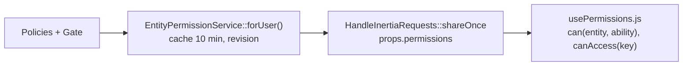

# Permissions & Authentification

La sécurité repose sur trois couches : un **rôle** utilisateur (entier 0→5), des **middlewares** qui protègent des zones de routes, et des **policies** qui décident finement par ressource. La **source de vérité est le serveur** (policies + middlewares) ; le front ne fait que projeter ces droits.

## Rôles

Stockés dans `users.role` (entier, défaut 1). Définis dans `app/Models/User.php` :

| Entier | Constante | Nom (`ROLES`) |
| --- | --- | --- |
| 0 | `ROLE_GUEST` | `guest` |
| 1 | `ROLE_USER` | `user` (défaut inscription) |
| 2 | `ROLE_PLAYER` | `player` |
| 3 | `ROLE_GAME_MASTER` | `game_master` |
| 4 | `ROLE_ADMIN` | `admin` |
| 5 | `ROLE_SUPER_ADMIN` | `super_admin` |

Un anonyme n'a pas de rôle stocké : `user === null` → niveau 0 dans les policies. Méthodes clés : `verifyRole($role)` (comparaison `>=`, un super_admin renvoie toujours true), `isAdmin()` (≥4), `isGameMaster()` (≥3), `isSuperAdmin()` (=5).

Distinction importante : `isSuperAdmin()` inclut le compte **système** ; `isInteractiveSuperAdmin()` = super_admin **humain** (`role===5 && !is_system`), utilisé pour les bypass web. La prop Inertia `is_super_admin` correspond à l'interactif. Un seul super_admin humain par instance (`User::booted()`).

## Authentification

Guard par défaut `web` (session) — `config/auth.php`. Contrôleurs dans `app/Http/Controllers/Auth/` :

| Contrôleur | Rôle |
| --- | --- |
| `AuthenticatedSessionController` | login/logout, `last_login_at`, notification de connexion |
| `RegisteredUserController` | inscription (`role = ROLE_USER`) puis vérification email |
| `PasswordResetLinkController`, `NewPasswordController` | reset de mot de passe |
| `VerifyEmailController`, `EmailVerification*Controller` | vérification email |
| `ConfirmablePasswordController` | page de confirmation de mot de passe |
| `OAuthController` | OAuth (voir ci-dessous) |

Login (`LoginRequest`) : accepte email **ou** pseudo, refuse les comptes soft-deleted et système (`canLogin()`). Routes : `routes/auth.php`.

**Sanctum** : la route `GET /api/user` (`routes/api/auth.php`) existe avec `auth:sanctum`, mais le modèle `User` n'utilise pas `HasApiTokens` — les tokens API personnels ne sont pas branchés. À considérer comme un stub ; l'auth réelle passe par la session.

## OAuth

Modèle `app/Models/OAuthAccount.php` (table `oauth_accounts`, unique `(provider, provider_id)`), providers `github`, `discord`, `steam`. Activation via `app/Support/OAuthConfig.php` (credentials `.env` → `config/services.php`).

Flux (`OAuthController`) :
1. **redirect** : Socialite ; si déjà connecté avec `?link=1`, marque l'intention de liaison.
2. **callback** : compte OAuth existant → login (ou offre de transfert) ; sinon liaison au compte courant ; sinon email déjà connu → confirmation de liaison ; sinon création d'un compte `ROLE_USER`.
3. **confirmLink / transfer** : liaison à un email existant, ou transfert d'un `OAuthAccount` vers le compte courant.

Liaison depuis le profil : `routes/web/user.php` (`user.oauth.link/{provider}`, unlink, convert). `hasVerifiedEmail()` est vrai si email vérifié **ou** au moins un compte OAuth lié ; `canUnlinkProvider()` exige un mot de passe ou ≥2 providers.

## Middlewares

Alias enregistrés dans `bootstrap/app.php` :

| Alias | Fichier | Effet |
| --- | --- | --- |
| `role:a|b` | `CheckRole.php` | Non connecté → `login` ; super_admin interactif → bypass ; sinon OU logique sur les rôles ; sinon 403 |
| `admin.area` | `EnsureAdminAreaAccess.php` | `isAdmin()` sinon 403 |
| `content.area` | `EnsureContentManagementAccess.php` | `isGameMaster()` sinon 403 |
| `password.confirm` | `RequirePasswordWithInactivity.php` | Exige confirmation MDP récente (inactivité `password_inactivity_timeout`, défaut 3600 s) ; JSON/Inertia → **423**, sinon redirect `password.confirm` |

Exemple : les routes scrapping cumulent `web`, `auth`, `role:admin`, `password.confirm`.

## Policies

`app/Policies/Entity/BaseEntityPolicy.php` est la base des entités. Pour `view` : admin → auteur (`created_by`) → matrice « Gérer l'affichage » (`EntityDisplayVisibilityService`) → selon `state` (`playable`/`archived` : `rôle ≥ read_level` ; `raw`/`draft` : `rôle ≥ write_level`). Globales : `viewAny` true, `create` admin, `updateAny` game_master, `deleteAny`/`manageAny` admin.

Surcharges notables : `SpellPolicy` (`updateAny` admin), `BreedPolicy` (logique propre, n'étend pas la base), `PagePolicy`/`SectionPolicy` (CMS via `canBeViewedBy`/`canBeEditedBy`), `UserPolicy` (`before` = super_admin interactif, `updateRole` restreint). Enregistrement explicite partiel dans `app/Providers/AuthServiceProvider.php` ; le reste par auto-discovery Laravel.

## Configuration des permissions

- `config/entity-permissions.php` : registre `entityType` (kebab/pluriel) → classe Eloquent. Alimente `EntityPermissionService` et les clés de la matrice d'affichage.
- `config/access-permissions.php` : clés UI → règles `anyOf [entity, ability]` (ex. `adminPanel`/`scrapping` → `users`/`manageAny`, `pagesManager` → `pages`/`updateAny`).

## Projection vers le front

`EntityPermissionService` (`app/Support/EntityPermissions/`) produit `{ entities: { type: { viewAny, create, createAny, updateAny, deleteAny, manageAny } }, access: { key: bool } }`. `EntityDisplayVisibilityService` gère la matrice rôle minimal × état (réglages en `application_settings`).

Côté Vue : `usePermissions.js` lit `page.props.permissions` (`can(entity, ability)`, `canAccess(key)`, `isAdmin`/`isSuperAdmin`). Les droits **par ligne** (`view`/`update`/`delete` d'une fiche précise) viennent du champ `can` des Resources, pas de `usePermissions`. Pour les actions admin sensibles : `useProtectedAdminAction` + `ConfirmPasswordModal` (POST `user.password.confirm`).

## Pour aller plus loin

- `docs/features/permissions/README.md` — source de vérité des droits.
- `docs/features/permissions/README.md` — matrice de visibilité.
- Droits appliqués aux entités : [../entities/README.md](../entities/README.md#droits).
