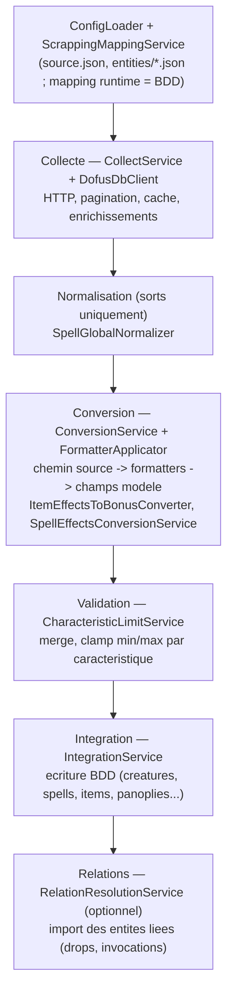

# Scrapping DofusDB

Le scrapping importe des données du jeu Dofus depuis l'API **DofusDB** et les convertit en entités KrosmozJDR (sorts, objets, ressources, consommables, monstres, classes, panoplies…). Le système est **config-driven** : la source de vérité du mapping est en base de données (bootstrappée depuis des fichiers JSON), pas dans le code.

### Conversion des monstres

Le niveau d'un monstre utilise l'échelle Dofus 1–300 vers Krosmoz 1–30 :
`floor([d]/10)`, puis limitation entre 1 et 30. Les niveaux Dofus 1 à 9 produisent
donc un niveau Krosmoz 1.

Les autres conversions propres aux monstres suivent ces principes :

- les six caractéristiques principales utilisent une courbe non linéaire entre 6 et 30 ;
- PA, PM, PO, esquives, Tacle et Fuite conservent leur valeur, avec des limites plus larges que les personnages ;
- les résistances Dofus deviennent des paliers relatifs `-100`, `-50`, `0`, `50` ou `100` ; elles n'alimentent pas les résistances fixes ;
- le bonus critique Dofus devient un bonus Krosmoz rare de 0 à 3 et le soin est ramené linéairement de 5–40 vers 0–7 ;
- les Kamas ne sont pas importés depuis un monstre.

### Conversion des objets et panoplies

Les effets numériques des objets sont convertis avec des formules signées : un malus Dofus reste un bonus
Krosmoz négatif, dans une plage symétrique. Les caractéristiques principales sont limitées à `±6`, les PA
à `±5` et les PM à `±2`, hors marge de forgemagie.

Les résistances en pourcentage sont ignorées pour les objets individuels et restent disponibles dans le
JSON brut. Pour les panoplies, elles deviennent des paliers de `-2` à `2` aux seuils `-50`, `-20`, `8`
et `13`. L'ID DofusDB `0` est volontairement ignoré car il regroupe des effets techniques hétérogènes ;
les dommages multi-éléments utilisent l'ID `16`.

Accès **réservé aux administrateurs** : toutes les routes (web et API) passent par `role:admin` + `password.confirm`. La page `/scrapping` impose une confirmation de mot de passe (`ConfirmPasswordModal`) avec un délai d'inactivité.

## Pipeline

Le pipeline est assemblé par `ScrappingPipelineFactory::createDefault()` (ou `Orchestrator::default()`), dépendances résolues via le conteneur Laravel. Pour les imports longs, l'exécution passe par `app/Jobs/ProcessScrappingJob.php` (suivi en table `scrapping_jobs`).

### Robustesse et diagnostics

- Les mappings sont validés avant conversion : chemin source, cibles, formatters et formules liées.
- Un formatter inconnu bloque explicitement la conversion au lieu d'être ignoré.
- `runMany()` isole les erreurs par élément et retourne `itemResults`, les compteurs `success` / `errors` et les diagnostics.
- Les conversions pilotées par une caractéristique exposent une trace : valeur brute, formule, résultat calculé et clamp éventuel.
- Une caractéristique ou un effet non mappé produit une revue manuelle ; l'import des autres données peut continuer en état `raw`.
- La prévisualisation web affiche les revues manuelles et les traces de conversion dans une section dédiée.

## Création Intelligente V1

La conversion des objets utilise maintenant une couche norm-aware minimale :
- `ItemEffectsToBonusConverter` filtre les bonus incompatibles avec le type d'équipement lorsque la caractéristique définit `allowed_item_type_ids`.
- `NormAwareEntityProcessor` enrichit la preview des items avec `_smart_creation` : puissance seedable, rapport aux `norms_grid`, signature de bonus et `price_calculated` indicatif.
- Les services purs sont testables sans base : `NormsResolver`, `PowerCoefficientAssigner`, `EquipmentPriceCalculator`, `DuplicateEquipmentSignatureChecker`.

Cette v1 enrichit la preview et prépare l'import normé sans forcer de snap automatique à l'écriture. Les imports continuent de passer par les validations min/max existantes.

## Où modifier le mapping

| Type de règle | Où | Support |
| --- | --- | --- |
| Chemin source → cible (`level`, `name`…) par entité | **BDD (runtime)** | `scrapping_entity_mappings` + `scrapping_entity_mapping_targets`. Bootstrap via `ScrappingEntityMappingSeeder` (data `database/seeders/data/scrapping_entity_mappings.php`). |
| Id caractéristique DofusDB → caractéristique Krosmoz (bonus objets/panoplies) | **BDD** | colonne `dofusdb_characteristic_id` sur `characteristic_object` (seeder `DofusdbCharacteristicIdSeeder`). |
| EffectId DofusDB → sous-effet Krosmoz (effets de sorts) | **BDD** (fallback PHP) | table `dofusdb_effect_mappings` (seeder `DofusdbEffectMappingSeeder`). |
| Formules / limites de conversion (niveau, vie, attributs) | **BDD** | `characteristic_creature`, `characteristic_object`, `characteristic_spell` (`formula`, `min`, `max`, `conversion_formula`). |

Vocabulaire : un **formatter** est une fonction whitelistée appliquée à une valeur extraite (ex. `dofusdb_level`), enregistrée dans `FormatterApplicator`. Un **`from_path`** est un chemin en notation point dans les données brutes (ex. `spell_global.apCost`). Une **target** est un couple `(model, field)`.

## Routes API (extrait)

Toutes préfixées `/api/scrapping` (`routes/api/scrapping.php`) :

- `GET /config`, `GET /meta` — configuration et métadonnées.
- `GET /search/{entity}` — recherche (collecte seule, sans intégration).
- `GET /preview/{type}/{id}`, `POST /preview/batch` — aperçu Brut / Converti / Krosmoz.
- `POST /jobs`, `GET /jobs`, `GET /jobs/{id}`, `POST /jobs/{id}/cancel` — jobs asynchrones.
- `POST /import/{class|monster|item|resource|consumable|spell|panoply}/{id}`, `POST /import/batch|range|all` — import.
- `GET|PATCH /resource-types`, `/item-types`, `/consumable-types` (+ `/pending`, `/decision`…) — registres de types.
- `GET /dofusdb/item-types`, `/monster-races` — catalogues DofusDB.

Les types d'objets/ressources/consommables et les races de monstres sont gérés **en BDD** (`item_types`, `resource_types`, `consumable_types`, `monster_races`) ; les catalogues DofusDB sont exposés par des services dédiés (`DofusDbItemTypesCatalogService`, `DofusDbMonsterRacesCatalogService`).
À l'import d'un monstre, `monster_race_id` reçu du mapping représente l'identifiant de race DofusDB :
l'intégration le résout vers la clé locale et crée une race brouillon si elle manque.

### Conversion des sorts

Le niveau de sort provient du niveau minimal Dofus et non du grade : il est divisé par 10 puis borné à
1–20. Les paramètres globaux sont bornés aux plafonds Krosmoz (portée 20, 6 lancers/tour, 4/cible,
10 tours de relance). Les bonus utilisés par les sous-effets sont convertis par leurs définitions
`*_spell` : critique signé, résistances relatives par paliers, résistances fixes, soins, initiative et
dégâts fixes.

L'identifiant DofusDB `16` alimente les dégâts fixes multi-éléments ; `103` désigne la puissance d'arme
et ne doit pas être utilisé à cette fin. Les métadonnées `castInLine`, `castInDiagonal`, type de cible,
cumul maximal et délai global sont normalisées séparément des effets.

Pour les effets, `diceNum` et `diceSide` sont des bornes minimale et maximale DofusDB, et non une notation
de dés. La plage est convertie en formule Krosmoz avant intégration ; la formule brute reste disponible
uniquement pour diagnostic. Les variantes négatives sont importées comme retraits, les vols de PA/PM
comme vols de caractéristiques, et les effets critiques disposent de leur propre formule convertie.

La zone et l’élément d’un sort ne sont pas importés depuis les champs globaux : ils sont déduits des
sous-effets de chaque degré. Les restrictions de lancement, le cumul maximal et le délai global sont
clampés à partir de leurs définitions `*_spell`, puis le snapshot des mappings est régénéré depuis ces
règles.

## Commandes CLI

| Commande | Rôle |
| --- | --- |
| `php artisan scrapping:setup` | Initialise le socle (migrations + seeders caractéristiques/mappings). Variantes `--fresh`, `--skip-migrate`. |
| `php artisan scrapping:run` | Collecte / preview / import des entités DofusDB (commande d'exploitation). |
| `php artisan scrapping:seeders:export` | Exporte les données BDD vers `database/seeders/data/*`. |
| `php artisan scrapping:types:seed` | Extrait les item-types depuis l'API puis seede les types. |
| `php artisan scrapping:effects:map` | Propose des mappings effectId → sous-effet. |
| `php artisan scrapping:audit` | Audite sans écriture les mappings, formules manquantes et mappings d'effets incomplets (`--json`, `--fail-on-review`). Les entités `catalogOnly` (ex. `monster-race`) sont ignorées. |

Pour un import massif, `php artisan scrapping:run --entity=monster --quality-gate` exécute cet audit
avant toute écriture et annule l'import si une règle nécessite encore une revue.

Les sorts locaux dont le `dofusdb_id` renvoie 404 côté API sont archivés (`state=archived`,
`auto_update=false`) : ils restent consultables mais ne sont plus candidats aux resync auto.

## UI (admin)

- Page : `resources/js/Pages/Pages/scrapping/Index.vue` (route `/scrapping`).
- Logique : composables `resources/js/Composables/scrapping/*` (`useScrappingJobManager`, `useScrappingSearch`, `useScrappingCompare`…), préférences via `useScrappingPreferences`.
- Comparaison Brut / Converti / Krosmoz pilotée par le mapping.

## Pour aller plus loin

- `docs/features/scrapping/README.md` — flux complet et points de modification.
- `docs/features/scrapping/README.md` — architecture config-driven.
- `docs/features/effects/README.md` — système d'effets (normalisation + bonus).
- `docs/features/scrapping/README.md` — mapping champ par champ.
