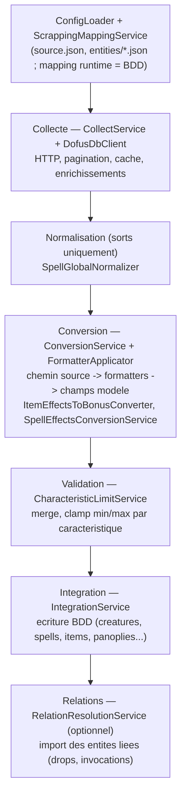

# Scrapping DofusDB

Le scrapping importe des données du jeu Dofus depuis l'API **DofusDB** et les convertit en entités KrosmozJDR (sorts, objets, ressources, consommables, monstres, classes, panoplies…). Le système est **config-driven** : la source de vérité du mapping est en base de données (bootstrappée depuis des fichiers JSON), pas dans le code.

Accès **réservé aux administrateurs** : toutes les routes (web et API) passent par `role:admin` + `password.confirm`. La page `/scrapping` impose une confirmation de mot de passe (`ConfirmPasswordModal`) avec un délai d'inactivité.

## Pipeline

Le pipeline est assemblé par `ScrappingPipelineFactory::createDefault()` (ou `Orchestrator::default()`), dépendances résolues via le conteneur Laravel. Pour les imports longs, l'exécution passe par `app/Jobs/ProcessScrappingJob.php` (suivi en table `scrapping_jobs`).

## Où modifier le mapping

| Type de règle | Où | Support |
| --- | --- | --- |
| Chemin source → cible (`level`, `name`…) par entité | **BDD (runtime)** | `scrapping_entity_mappings` + `scrapping_entity_mapping_targets`. Bootstrap via `ScrappingEntityMappingSeeder` (data `database/seeders/data/scrapping_entity_mappings.php`). |
| Id caractéristique DofusDB → caractéristique Krosmoz (bonus objets/panoplies) | **BDD** | colonne `dofusdb_characteristic_id` sur `characteristic_object` (seeder `DofusdbCharacteristicIdSeeder`). |
| EffectId DofusDB → sous-effet Krosmoz (effets de sorts) | **BDD** (fallback PHP) | table `dofusdb_effect_mappings` (seeder `DofusdbEffectMappingSeeder`). |
| Formules / limites de conversion (niveau, vie, attributs) | **BDD** | `characteristic_creature`, `characteristic_object`, `characteristic_spell` (`formula`, `min`, `max`, `conversion_formula`). |

Vocabulaire : un **formatter** est une fonction whitelistée appliquée à une valeur extraite (ex. `dofusdb_level`), enregistrée dans `FormatterApplicator`. Un **`from_path`** est un chemin en notation point dans les données brutes (ex. `spell_global.apCost`). Une **target** est un couple `(model, field)`.

## Routes API (extrait)

Toutes préfixées `/api/scrapping` (`routes/api/scrapping.php`) :

- `GET /config`, `GET /meta` — configuration et métadonnées.
- `GET /search/{entity}` — recherche (collecte seule, sans intégration).
- `GET /preview/{type}/{id}`, `POST /preview/batch` — aperçu Brut / Converti / Krosmoz.
- `POST /jobs`, `GET /jobs`, `GET /jobs/{id}`, `POST /jobs/{id}/cancel` — jobs asynchrones.
- `POST /import/{class|monster|item|resource|consumable|spell|panoply}/{id}`, `POST /import/batch|range|all` — import.
- `GET|PATCH /resource-types`, `/item-types`, `/consumable-types` (+ `/pending`, `/decision`…) — registres de types.
- `GET /dofusdb/item-types`, `/monster-races` — catalogues DofusDB.

Les types d'objets/ressources/consommables et les races de monstres sont gérés **en BDD** (`item_types`, `resource_types`, `consumable_types`, `monster_races`) ; les catalogues DofusDB sont exposés par des services dédiés (`DofusDbItemTypesCatalogService`, `DofusDbMonsterRacesCatalogService`).

## Commandes CLI

| Commande | Rôle |
| --- | --- |
| `php artisan scrapping:setup` | Initialise le socle (migrations + seeders caractéristiques/mappings). Variantes `--fresh`, `--skip-migrate`. |
| `php artisan scrapping:run` | Collecte / preview / import des entités DofusDB (commande d'exploitation). |
| `php artisan scrapping:seeders:export` | Exporte les données BDD vers `database/seeders/data/*`. |
| `php artisan scrapping:types:seed` | Extrait les item-types depuis l'API puis seede les types. |
| `php artisan scrapping:effects:map` | Propose des mappings effectId → sous-effet. |

## UI (admin)

- Page : `resources/js/Pages/Pages/scrapping/Index.vue` (route `/scrapping`).
- Logique : composables `resources/js/Composables/scrapping/*` (`useScrappingJobManager`, `useScrappingSearch`, `useScrappingCompare`…), préférences via `useScrappingPreferences`.
- Comparaison Brut / Converti / Krosmoz pilotée par le mapping.

## Pour aller plus loin

- `docs/features/scrapping/README.md` — flux complet et points de modification.
- `docs/features/scrapping/README.md` — architecture config-driven.
- `docs/features/effects/README.md` — système d'effets (normalisation + bonus).
- `docs/features/scrapping/README.md` — mapping champ par champ.
