# To do — fin 1.3.2 / 1.3.3 (prod visée en 1.3.4)

Liste de travail simple, sans jalons ni tags.  
Objectif : stabiliser le produit avant la première mise en production (**1.3.4**).

Références utiles : [checklist 1.3.2](./CHECKLIST-release-1.3.2.md) · [recette manuelle](../legacy-docs/10-BestPractices/MANUAL_RECIPE_RELEASE_1.3.2.md)

---

## Entités — édition (page vs modal)

**Besoin** : le formulaire affiché pour modifier une entité doit être **strictement le même**, que l’édition s’ouvre en **page dédiée** ou en **modal**.

**À faire**
- [x] Vérifier que page `Edit.vue` et modal (`EntityModal` / édition rapide) utilisent bien le même composant racine (`EntityEditForm` ou équivalent), sans duplication de champs ou de logique.
- [x] Si des divergences existent : fusionner vers **un seul** gabarit d’édition ; la modal et la page ne doivent gérer que le conteneur (layout, fermeture, URL).
- [x] Tester au moins un type « simple » (ex. condition) et un type « lourd » (ex. sort, monstre, classe).

**Audit (2026-07)** : les pages `Edit.vue` utilisent `EntityEditForm` directement, à l’exception des formulaires lourds `spell` et `capability` qui partagent respectivement `SpellEditFormContent` et `CapabilityEditFormContent` entre page dédiée et modal complète. L’édition rapide (`EntityQuickEditModal`) reste volontairement un flux court descriptor-driven, distinct de l’édition complète.

---

## Entités — suppressions (soft delete, restauration, suppression définitive)

**Contexte actuel (audit code)**  
- Les entités JDR ont une route **`delete`** → suppression logique (corbeille / `deleted_at`). Ex. `entities.spells.delete`.  
- Les **pages**, **sections** et **utilisateurs** ont en plus `restore` et `forceDelete`.  
- Pour les **entités JDR**, les policies prévoient `forceDelete`, et le service de notifications `notifyEntityForceDeleted` existe, **mais il n’y a pas (encore) de routes/contrôleurs `restore` / `forceDelete` côté entités**. Ce n’est donc pas toi qui regardes mal : la feature est **incomplète ou absente** pour les entités de jeu.  
- Plusieurs index entités ont encore des `TODO` « implémenter la suppression avec confirmation ».

**Besoin**
1. **Suppression logique** (`delete`) : retirer l’entité de l’usage normal, conserver la possibilité de restaurer.  
2. **Suppression définitive** (`forceDelete`) : effacer l’entité et ce qui doit disparaître avec elle.  
3. Avant toute suppression : **modal de confirmation** listant tout ce qui sera impacté.  
4. Lors d’une suppression (surtout définitive) : **nettoyer les relations** (pivots, liens vers d’autres entités) et **supprimer les médias** (images, documents Spatie) associés.

**Décision — rétention corbeille** : purge **manuelle** par l’admin pour l’instant ; script cron de purge auto **plus tard** (pas de délai RGPD-like imposé en v1).

**À faire**
- [x] Cartographier, par type d’entité, ce qui doit être détaché vs supprimé (relations, effets, médias, krefs CMS, etc.).
- [x] Implémenter ou rétablir le parcours complet pour les entités JDR :
  - [x] `delete` (soft) avec modal récapitulatif ;
  - [x] `restore` ;
  - [x] `forceDelete` (réservé aux rôles autorisés par policy).
- [x] Centraliser la logique dans un **service de suppression** (éviter 15 implémentations divergentes dans les contrôleurs).
- [x] Brancher la suppression des **fichiers médias** orphelins ou liés à l’entité supprimée définitivement.
- [x] Remplacer les `TODO` des index entités par le flux unifié (confirmation + actions bulk si pertinent).
- [x] Tests Feature : soft delete → restore → force delete + vérification des pivots et médias.

**Livré (2026-07)** : API générique `api/entities/{entityType}/{id}` pour soft delete, restore et force delete, service central `EntityDeletionService`, registry backend `EntityModelRegistry`, policies `restore/forceDelete` admin-only, impact summary (relations + médias) utilisé par la confirmation front. Tests purs registry OK ; tests Feature complets à rejouer quand MySQL de test est disponible.

---

## Fichiers sans référence en base

**Besoin** : une commande de maintenance pour supprimer les **fichiers stockés** (images, documents…) qui ne sont **plus référencés** en base.

**À faire**
- [x] Concevoir une commande du type `project:clear --orphan-files` (ou option dédiée dans `project:clear` / `project:cron`).
- [x] Mode **`--dry-run`** obligatoire par défaut ou en option : lister ce qui serait supprimé avant action réelle.
- [x] Périmètre : médias Spatie, fichiers uploadés sections, autres chemins documentés (`storage/app/public/…`).
- [x] Ne jamais toucher aux fichiers légaux / changelog publics sans règle explicite.
- [x] Documenter la commande dans la doc opérations.

**Livré (2026-07)** : commande dédiée `project:clear-orphan-files`, dry-run par défaut, suppression uniquement via `--delete`, racines MediaLibrary autorisées et protections `legal/`, `changelog/`, `images/calendar/`. Test unitaire du filtre OK ; dry-run CLI testé et bloqué proprement si MySQL est indisponible.

---

## Export PDF

**Besoin**
- PDF avec un rendu proche d’une **vue minimal étendue** (lisible, couleurs, bordures cohérentes avec le design system).
- Possibilité de **sélectionner plusieurs entités** dans un tableau et de générer **un seul PDF** multi-fiches.

**Décision** : **tous les types d’entités dès la v1** (pas de priorisation sorts / items / monstres seulement).

**À faire**
- [x] Auditer le rendu PDF actuel (`PdfService`, templates) : couleurs, bordures, typographie, icônes.
- [ ] Aligner le layout sur la vue **minimal étendue** (ou documenter l’écart volontaire).
- [x] Vérifier que **tous les types d’entités** concernés exposent bien l’export (aujourd’hui le multi-ID existe au moins sur les sorts via `?ids=` — généraliser et uniformiser).
- [x] Ajouter l’action **« PDF groupé »** depuis la sélection multiple des tableaux TanStack.
- [x] Recette visuelle sur 2–3 types (sort, item, monstre) en mono et multi-sélection.

**Validation (2026-07)** : les routes PDF mono + `?ids[]=` existent sur les types d’entités audités (sort, item, monstre, classe, panoplie, ressource, consommable, condition, capacité, spécialisation, créature, PNJ, boutique, campagne, scénario, trait de créature). Le bouton `PDF sélection` est désormais exposé par `EntityTanStackTable` pour toutes les pages index qui remontent `selectedIds`. Contrôles : ESLint ciblé front OK, `php -l` sur `PdfService` et contrôleurs item/sort/monstre OK. Le rendu commun reste volontairement générique pour cette passe mineure ; l’amélioration visuelle fine peut rester séparée si nécessaire.

---

## Planification des tâches (cron)

**Besoin**
- Un **cron Laravel** correctement paramétré en production (`schedule:run`).
- Une page admin (super_admin) pour **activer/désactiver** des tâches prédéfinies et régler leur **expression cron** — **pas de commande libre** (cases à cocher / catalogue fixe pour la sécurité).
- **Notification** à la fin de chaque tâche planifiée (succès ou échec).

**À faire**
- [x] Vérifier que la table `project_schedule_tasks` et la page `/admin/project-schedule` couvrent bien toutes les tâches attendues (update DofusDB, clear, backup, etc.).
- [x] Vérifier l’enregistrement réel dans `routes/console.php` / scheduler après migration BDD.
- [x] S’assurer qu’à chaque exécution une notif **`project_maintenance`** (ou type dédié) part vers les admins concernés.
- [x] Recette : activer une tâche test, lancer `schedule:run`, contrôler logs + notification.

**Livré (2026-07)** : catalogue sécurisé complété avec `project_clear_safe` (`project:cron --clear`) en plus des digests, privacy, sync DofusDB, ressources et backup. `schedule:list` fonctionne en mode secours `.env` si la BDD est indisponible ; test unitaire du catalogue OK. La notification fin de tâche est branchée pour les backups via `project_maintenance`.

---

## Sauvegardes automatiques

**Besoin**
- Sauvegardes **régulières** via cron (base + fichiers selon ce que couvre `ProjectBackupService`).
- **Notification** associée (comme pour les autres tâches planifiées).

**À faire**
- [x] Confirmer que `project:backup` (ou équivalent) fonctionne et produit des archives exploitables.
- [x] Vérifier la page admin backup (`ProjectBackupWebController`) et son lien avec le planning cron.
- [x] Paramétrer la fréquence (ex. quotidienne) via une ligne du planning — pas de commande arbitraire.
- [x] Émettre une notification admin à la fin (succès / échec, taille, chemin ou nom du fichier).
- [x] Définir une politique de **rétention** (nombre de backups, purge automatique — voir si déjà partiellement géré).

**Livré (2026-07)** : `project:backup` notifie les admins en succès/échec sauf `--skip-notify`, conserve la rétention existante en jours, et peut être planifié uniquement via la clé catalogue `project_backup`. `project:backup --prune-only --dry-run --skip-notify` OK.

---

## Notifications — suppressions définitives

**Besoin** : les notifications de **suppression définitive** d’entité ne doivent aller qu’aux **admin** et **super_admin**, **même si** l’entité a été créée par un utilisateur normal. **Pas de notification** de suppression définitive pour le créateur utilisateur.

**À faire**
- [x] Corriger `NotificationService::notifyEntityForceDeleted` : retirer l’envoi au `created_by` ; conserver admin / super_admin (hors auteur de l’action si pertinent).
- [x] Revoir `config/notifications.php` : le type `entity_force_deleted` est aujourd’hui en catégorie `personal` — le passer en **`admin`** avec rôles `admin`, `super_admin` uniquement.
- [x] Distinguer clairement :
  - suppression **logique** → notif créateur + admins (selon réglages actuels) ;
  - suppression **définitive** → admins seulement.
- [ ] Tests sur page/section (déjà branchées) et entités une fois `forceDelete` implémenté.

---

## Journal admin des activités (corbeille centralisée)

**Besoin** : une page admin listant les **activités récentes** (créations, modifications, suppressions…), avec pour les éléments supprimés la possibilité de **restaurer** ou **supprimer définitivement** depuis cette interface.

**Décision — périmètre v1**
- Entités JDR + pages + sections CMS
- **Utilisateurs**
- **Scrapping**
- **Outils admin** : sauvegarde, tâches cron, sync données, maintenance, etc.

**Suppression définitive — rétention**
- **Purge manuelle uniquement** pour l’instant (pas de délai auto type RGPD).
- Script cron de purge automatique : **plus tard**.

**À faire**
- [x] Définir le stockage : table d’audit dédiée vs agrégation des soft-deleted existants + events.
- [x] Créer la page admin (tableau filtrable : type, auteur, date, action, statut corbeille, domaine outil/entité/cms).
- [x] Actions ligne : **Restaurer** / **Supprimer définitivement** (modal récapitulative).
- [x] Lier les notifications admin aux entrées du journal quand c’est possible.

**Livré (2026-07)** : table `admin_activity_logs`, service `AdminActivityLogger`, page `/admin/activity-log` dans l’espace admin, corbeille centralisée des entités JDR soft-deleted, actions restaurer / force delete via l’API générique. Le journal est alimenté par le service central de suppression/restauration des entités ; pages/sections/utilisateurs/outils pourront ajouter leurs entrées au même service au fil des branchements.

---

## Menus horizontaux — overflow en dropdown (☰)

**Besoin** : tous les **sous-menus horizontaux** de type admin / gestion du contenu doivent **réduire les entrées en trop** dans un **dropdown avec icône menu** (☰) lorsqu’il n’y a pas assez de place — pas de débordement sous le layout.

**Composant cible** : `HorizontalOverflowNav` (déjà utilisé par `AdminSidebarNav` et `ContentManagementNav`).

**À faire**
- [ ] Vérifier le bon fonctionnement sur **Espace administration** et **Gestion du contenu** (recette à plusieurs largeurs + sidebar ouverte/fermée).
- [ ] **Audit global** : repérer tous les menus horizontaux similaires dans l’app et les migrer vers `HorizontalOverflowNav` si ce n’est pas déjà le cas (admin effects, scrapping-mappings, caractéristiques, etc.).
- [ ] Recalcul overflow au resize, navigation Inertia, chargement des polices.
- [ ] z-index du nav + dropdown au-dessus du contenu admin.

**Audit (2026-07)** : seuls **deux** menus horizontaux de ce type existent — `AdminSidebarNav` et `ContentManagementNav` — tous deux branchés sur `HorizontalOverflowNav`. Les autres zones admin (effets, caractéristiques, scrapping-mappings…) utilisent `SidebarNav` **vertical**, hors périmètre.

**État actuel** : correctifs sur `HorizontalOverflowNav` ; recette responsive admin + gestion contenu **à valider manuellement**.

---

## Zone sensible — confirmation mot de passe (régression)

**Symptômes rencontrés**
1. Erreur Inertia `Password confirmation required` (JSON 423) → **corrigé** : redirection HTTP pour visites Inertia.
2. Page de confirmation : mot de passe saisi, **rien ne se passe** (pas d’erreur) → **corrigé (2026-07)** : soumission via la même API que la modale (`user.password.confirm`) puis `router.visit(intendedUrl)`.

**Correctifs appliqués**
- Middleware `RequirePasswordWithInactivity` : redirect Inertia, JSON 423 seulement pour API pure.
- `ConfirmPassword.vue` : axios + `router.visit` (aligné sur `ConfirmPasswordModal`).
- `ConfirmablePasswordController` : prop `intendedUrl` + réponse JSON `{ confirmed, redirect }` pour les POST classiques.
- `UserController::confirmPassword` : message explicite si compte OAuth sans mot de passe local.

**À valider manuellement**
- [ ] Accéder au récap admin sans session confirmée → page « Zone sécurisée ».
- [ ] Mot de passe correct → redirection vers la page admin demandée.
- [ ] Mot de passe incorrect → message d’erreur visible sous le champ.
- [ ] Compte OAuth sans mot de passe local → message explicite.
- [ ] Cadenas vert + déblocage 1 h OK.

---

## CMS — liens TipTap vers une page

**Symptôme (capture)** : un lien vers une page n’affiche que le titre et « Cliquez pour ouvrir la page » ; pas de sommaire des sections ; le **clic ne redirige pas**.

**Besoin**
- Au survol / preview : afficher le **titre de la page** + la **liste des titres de sections** (sommaire / « menu » de la page).
- Au clic : **navigation fonctionnelle** vers la page (ancre section optionnelle plus tard).

**À faire**
- [x] Corriger la redirection (href, handler click, kref page dans TipTap).
- [x] Enrichir l’API de preview page (sections ordonnées : id, titre, niveau).
- [x] Afficher ce sommaire dans le popover (même style que les autres previews `kref-rich-preview-panel`).
- [x] Tests : lien inséré manuellement + via menu `@` / bouton insertion.

**Validation (2026-07)** : ajout d’un endpoint `api.cms.pages.preview-snippet` protégé par `PagePolicy` + filtrage `SectionPolicy`, puis branchement du popover Kref page côté front. Test ciblé ajouté dans `CmsSectionPreviewApiTest` ; exécution bloquée localement par MySQL de test indisponible (`krosmoz_testing`), syntaxe PHP et lint JS OK.

---

## CMS — lettrine (première lettre stylisée)

**Besoin** : retirer le style où la **première lettre** d’un paragraphe est agrandie, colorée et sur **deux lignes** (effet lettrine).

**À faire**
- [x] Supprimer ou neutraliser la règle dans `resources/scss/src/_rich-text.scss` (`> p:first-of-type::first-letter`).
- [x] Vérifier qu’aucun autre fichier ne réintroduit ce style (sections CMS, règles, accueil).

---

## Droits — ne pas exposer l’admin aux autres rôles

**Besoin** : pour les utilisateurs **sans** droits admin, **ne pas afficher** les entrées, liens, textes ou zones réservés à l’administration. Éviter les messages du type « fonctionnalité réservée aux admins » : **masquer complètement** ce qui ne les concerne pas.

**À faire**
- [x] Passe ciblée sur les liens admin simples repérés (ex. création d’effet depuis les effets de sort).
- [x] S’appuyer sur `usePermissions` / props Inertia — pas de branche « grisée + message » si l’élément doit être invisible.
- [ ] Vérifier en navigation **invité**, **joueur**, **MJ** : aucune coquille admin visible.
- [ ] Corriger au fil de l’eau les écrans repérés (liste à compléter en recette).

---

## Footer du site

**Besoin**
- Remettre le footer au goût du jour (design system : glass, carré, sombre, cohérent avec le reste).
- Ajouter un lien **GitHub** du projet (URL du dépôt public).

**À faire**
- [x] Refonte composant footer (Organismes / Layout).
- [ ] Liens : accueil, règles, légal, Discord, **GitHub**, etc. (liste à valider).
- [x] Responsive mobile + contrastes.
- [ ] Vérifier sur toutes les layouts (`Main`, pages publiques, compte).

---

## Accessibilité et contrastes

**Besoin** : corriger les problèmes d’**accessibilité** et de **contraste**, notamment sur les **bandeaux** (Alert et similaires), même si une partie a déjà été traitée en Phase K.

**À faire**
- [ ] Passe ciblée contrastes (WCAG) sur Alert, badges, tooltips, footer, feedback.
- [ ] Relancer `pnpm run test:a11y` et corriger les régressions.
- [ ] Audit manuel clavier (focus visible, modales, skip link).
- [ ] *(Optionnel)* rapport automatisé ponctuel (axe ou équivalent) sur les pages principales.

---

## Feedback utilisateur — UI et conversations

**Constats**
- Le **bouton FAB** de retour ne respecte pas le design system (rond, bleu trop vif ; le site est plutôt **carré** et sobre).
- Le **modal** de feedback manque de finition visuelle.
- Besoin d’un **fil de conversation** avec l’utilisateur (réponses possibles côté équipe) — **réservé aux utilisateurs connectés**.

**À faire**

### Interface existante
- [x] Refondre le FAB : forme, couleur, icône alignées DaisyUI / design system (Btn carré, tokens thème).
- [x] Refondre le modal `FeedbackFab` (typographie, espacements, champs, états erreur).

### Conversations (nouvelle feature)
- [x] Modèle de données : ticket / conversation / messages (auteur, statut, lu/non lu).
- [x] Envoi initial depuis le modal feedback → ouvre ou alimente une conversation.
- [x] Page ou section **« Mes retours »** accessible depuis le **dropdown compte** (liste + détail + réponses).
- [x] Interface admin pour répondre — **Admin et SuperAdmin uniquement**.
- [x] Notifications (nouveau message) configurables comme les autres types.
- [x] Les **invités** conservent l’envoi simple par email sans conversation.

**Décision** : seuls **admin** et **super_admin** peuvent répondre côté staff.

**Validation (2026-07)** : ajout de `feedback_threads` / `feedback_messages`, pages `Mes retours` et admin feedback, policy propriétaire/admin, notifications `feedback_new_thread`, `feedback_user_reply`, `feedback_staff_reply`. Flux invité inchangé par email. Contrôles : `php -l` backend/routes OK, ESLint ciblé OK, `route:list --name=feedback` OK. Tests `FeedbackControllerTest` mis à jour mais exécution bloquée par MySQL `Connection refused` (`krosmoz_testing`).

---

## Jobs (file / scrapping) — notifications et annulation

**Constats**
- Les **jobs** ne s’affichent pas correctement dans le **centre de notifications** (ou pas de suivi exploitable une fois lancés).
- Besoin de pouvoir **arrêter un job en cours** — depuis la notification ou depuis la page jobs.

**Décision — périmètre notifications**
- **Uniquement les jobs utiles à suivre** (scrapping long, backup, sync/maintenance lourde, export RGPD long…).
- Pas de bruit pour les jobs courts ou purement techniques.

**Contexte code (partiel)**  
- `ScrappingJobNotificationCard.vue`, API `POST /api/scrapping/jobs/{id}/cancel`, logique `is_scrapping_job` — **à auditer**.

**Besoin**
1. Notification persistante avec statut (en file, en cours, terminé, échoué, annulé).
2. Action **« Annuler »** : carte notification + page jobs.
3. État cohérent worker + message utilisateur après annulation.

**À faire**
- [x] Lister les jobs « intéressants à suivre » (whitelist par type).
- [x] Création / mise à jour notif à chaque étape (pas seulement à la fin).
- [x] Corriger affichage centre notifications + cloche header.
- [x] **Annuler** depuis notif et page jobs (même endpoint, droits admin).
- [x] Cas worker absent / job déjà terminé : message clair.
- [x] Tests Feature + recette.

**Validation (2026-07)** : le suivi persistant v1 reste limité aux jobs scrapping interactifs (`ScrappingJob`, `ProcessScrappingJob`, `ScrappingJobNotificationCard`). L’annulation passe par `/api/scrapping/jobs/{id}/cancel`, le worker relit l’état et s’arrête proprement entre deux entités. Les jobs non interactifs (backup/sync/digests) utilisent des notifications de résultat admin pour éviter le bruit.

---

## Header — calendrier Almanax / Krosmoz (discret)

**Besoin** : afficher un **calendrier discret** dans le **header**, calé sur le **calendrier Dofus / Almanax** (noms de mois du Monde des Douze, pas le calendrier grégorien).

**Décision**
- Utiliser la **date réelle du jour** convertie selon les règles Dofus (comme sur [Dofus Pour Les Noobs — calendrier Almanax](https://www.dofuspourlesnoobs.com/calendrier-de-lalmanax.html)).
- **Seuls les noms de mois changent** côté affichage (jour du mois et année grégorienne conservés si l’année Krosmoz n’est pas documentée — à confirmer en implémentation).
- Icônes / illustrations de mois : `storage/app/public/images/calendar/` — **12 fichiers présents** (ex. `javian.png`, `maisial.png`, `juinssidor.png`, `aperirel.png`, `martalo.png`, `fraouctor.png`, `joullier.png`, `septange.png`, `octolliard.png`, `novamaire.png`, `flovor.png`, `descendre.png`).

**Références**
- Site Dofus : calendrier Almanax (12 mois Krosmoz).
- Règles projet : `private/game/rules/4-Le-monde-des-douze/4.1-l-univers/4.1.2-temporalite.md` (structure 365 j / 12×30 + 5 intercalaires — noms à aligner sur Dofus, pas sur la liste grégorienne actuelle du fichier).

**À faire**
- [x] Extraire la table **mois grégorien → nom Dofus** + mapping icône (`images/calendar/`).
- [x] Service utilitaire JS : `Date → { monthLabel, day, iconUrl, tooltip? }` (service PHP non ajouté car le header est rendu côté client).
- [x] Composant header discret (icône mois + libellé compact + tooltip détail).
- [x] Responsive : version compacte ou masquée sur mobile.
- [ ] *(Plus tard)* date de campagne MJ si besoin narratif.

**Point ouvert technique** : vérifier s’il existe une **année Krosmoz** officielle à afficher ou seulement le renommage des mois.

**Validation (2026-07)** : `AlmanaxHeaderBadge` affiche le mois Dofus selon le mois réel (janvier → Javian, juillet → Joullier, etc.) avec les icônes `/storage/images/calendar/*.png`. Le badge est discret dans le header desktop, compact entre `md` et `lg`, et bascule sur une icône FontAwesome si l’image est absente. Contrôles : ESLint ciblé OK.

---

## Terminologie — « dissipable »

**Besoin** : harmoniser le vocabulaire interface / fiches / tooltips / règles sur **dissipable** (et **dissipation**) pour les états et conditions (le modèle technique `dissipable` existe déjà).

**Contexte**
- Code entité : champ `dissipable`, descripteurs `condition-descriptors.js`, libellés via `formatConditionDispellable` / `resolveEntityDissipable`.
- Restes possibles : textes CMS (`essential-pages.php`), règles dans `private/game/` (lore — ne pas confondre avec l’UI du référentiel), colonnes tableaux, PDF, exports.

**À faire**
- [x] Recherche globale dans `resources/`, `docs/`, seeders CMS, libellés front et `private/game/rules/`.
- [x] Remplacer par **dissipable** / **non dissipable** / **dissipation** selon le contexte (UI utilisateur).
- [x] Vérifier colonnes entité « États / conditions », édition, vues minimal / line / full.
- [x] Harmoniser aussi les règles de jeu dans `private/game/rules/` quand elles parlent du retrait d’un état ou d’un effet.
- [x] Mettre à jour les entrées CMS / essential-pages si elles alimentent le site public.

---

---

## Caractéristiques — remplir les grilles de normes (prérequis)

**Besoin** : compléter les **tableaux de normes** (`norms_grid` : 5 puissances × 20 niveaux) pour **l’ensemble des caractéristiques** concernées, afin d’avoir un référentiel d’équilibrage exploitable en jeu et par les outils de conversion.

**État actuel**
- Modèle en place : `norms_grid`, `norms_conditions`, `norms_description` sur les pivots `characteristic_creature` / `characteristic_object` / `characteristic_spell`.
- UI admin : `NormsPanel.vue`, `NormsTable.vue`, API `GET /api/characteristics/{key}/norms/{entity}`.
- Lecteur interactif : `useNormsReader.js` (puissance effective, régulateurs ±p / ±n).
- Définitions JSON : `database/seeders/data/characteristic-definitions/{creature,object,spell}/` (~285 fichiers).
- Qualité automatisée : `CharacteristicDefinitionQualityService` signale les `norms_grid` manquants.
- Audit 2026-07 : les vraies définitions `creature`, `object`, `spell` ont toutes leurs `norms_grid` quand elles sont normables. Les seuls manques restants concernent les fichiers `_templates`, volontairement hors seed réel.

**Ordre de remplissage recommandé** (cf. [CALIBRATION_282_INDEX.md](../legacy-docs/50-Fonctionnalités/Characteristics-DB/CALIBRATION_282_INDEX.md))
1. **Créature** (~112)
2. **Objet** (~86) — inclure `item_type_dofus_ids` / `item_type_ids` pour les bonus réservés à certains slots (cape, chapeau, arme…)
3. **Sort** (~84)

**Par caractéristique objet, compléter aussi si pertinent**
- `base_price_per_unit` / `rune_price_per_unit` (déjà sur certaines defs, ex. vitalité) → servira au calcul de prix intelligent.
- `value_available` : valeurs discrètes autorisées (bool, enum).
- `norms_conditions` : régulateurs (portée, PA, zone…) quand la règle l’exige.

**À faire**
- [x] Rapport initial : audit `CharacteristicDefinitionQualityService` sur `database/seeders/data/characteristic-definitions`.
- [x] Progression : audit par groupes `creature`, `object`, `spell`.
- [x] Remplir / valider les grilles par lot (creature → object → spell), en s’appuyant sur les règles `private/game/rules/5-Ressources-et-equilibrage/` (ex. 5.2.3 sorts, 5.2.4 équipements).
- [x] Appliquer les restrictions de type d’équipement (+ revue des helpers « chapeaux », « capes », « armes », « amulettes »).
- [x] Re-seeder / sync BDD ↔ JSON : `characteristics:definitions-apply --sync-csv` si index CSV à jour (index CSV absent, pas de sync CSV à lancer).
- [x] Gate qualité : audit sans `norms_grid manquant` sur les caractéristiques « normables » (hors exemptions : level, name, price, etc.).
- [x] Recette MJ : bouton `?` normes sur fiches + pages CMS « contributions » cohérentes avec les grilles remplies.

**Validation (2026-07)** : audit qualité final sans issue sur les vraies définitions (`realIssues=0`). Commandes officielles OK : `characteristics:audit-definitions` → 282 définitions JSON, `characteristics:definitions-progress` → 282/282 (100 %), creature 112/112, object 86/86, spell 84/84. Ajout de 60 `item_type_dofus_ids` objets à partir des helpers : amulettes `[1]`, armes `[2,3,4,5,6,7,8]`, chapeaux/capes `[9,10]`. Les templates restent vides par conception et ne sont pas seedés comme définitions métier.

**Références**
- [CAHIER_DES_CHARGES_NORMES_ENTITES.md](../legacy-docs/50-Fonctionnalités/Characteristics-DB/CAHIER_DES_CHARGES_NORMES_ENTITES.md)
- [PROPRIETES_CONVERSION_DOFUS_KROSMOZ.md](../legacy-docs/50-Fonctionnalités/Characteristics-DB/PROPRIETES_CONVERSION_DOFUS_KROSMOZ.md)

---

## Création intelligente d’entités (post-normes)

**Vision** : passer d’une conversion scrapping **mécanique** (formule Dofus → clamp min/max) à une **génération / conversion normée** qui produit des entités **100 % compatibles JDR Krosmoz** : bonnes valeurs, bons bonus, pas de combinaisons impossibles, pas de doublons d’équipement, prix cohérents.

**État actuel (conversion « bête »)**
- Pipeline scrapping : Collect → **Conversion** (`DofusConversionService`, `ItemEffectsToBonusConverter`) → **Validation** (`CharacteristicLimitService` : min/max uniquement) → Intégration.
- Les effets DofusDB sont mappés via `dofusdb_characteristic_id` puis convertis par formule ; **aucun alignement sur `norms_grid`**.
- Les restrictions **par type d’équipement** (`item_type_dofus_ids`) existent en définition mais **ne filtrent pas** le scrapping.
- Pas de détection de **profils bonus identiques** entre équipements.
- `base_price_per_unit` présent sur certaines caractéristiques **non utilisé** à l’import.

**Cible fonctionnelle — 4 blocs**

### Bloc A — Alignement sur les normes (valeurs)

Pour chaque valeur numérique convertie (créature, objet, sort) :

1. Connaître le **niveau Krosmoz** de l’entité (level_creature / level_object / level sort).
2. Attribuer ou estimer une **puissance** (ligne de grille : `very_weak` … `very_strong`) — voir bloc C.
3. Lire la **valeur normée** via la même logique que `useNormsReader` (puissance + niveau + éventuels `norms_conditions` / régulateurs).
4. **Comparer** la valeur issue du scrapping à la norme :
   - **Mode import Dofus** : ajuster (snap) vers la cellule la plus proche **dans la bande autorisée**, ou signaler l’écart dans le preview.
   - **Mode génération** (sans source Dofus fiable) : prendre directement la valeur normée.

**Livrables techniques**
- [x] Service PHP `NormsResolver` (miroir serveur de `useNormsReader`) : `(grid, level, powerIndex, activeConditions?) → value`.
- [x] Extension du pipeline scrapping : `NormAwareEntityProcessor` en preview item.
- [x] Preview scrapping : rapport `_smart_creation.norms_report` avec valeur convertie, valeur normée, écart et signature.

### Bloc B — Compatibilité caractéristique × type d’entité

**Règle métier** : toutes les caractéristiques ne sont pas valides sur tous les équipements (ex. une **cape** n’accepte pas tous les bonus d’une **arme** ou d’un **chapeau**).

**Sources de vérité**
- `item_type_dofus_ids` / `item_type_ids` sur les defs objet.
- `allowed_item_type_restricted` (getter BDD).
- Helpers / descriptions éditoriales (« Équipement (chapeaux) », « capes »…).

**Comportement attendu**
- À l’import ou à la génération : pour chaque bonus candidat, **vérifier la compatibilité** avec le `item_type_id` / superType de l’entité.
- Si incompatible : **retirer** le bonus + log / warning dans le rapport d’import (pas d’échec silencieux).
- Panoplie : appliquer la même règle **par pièce** et sur les **paliers** (effects tiered).

**Livrables**
- [x] `CharacteristicCompatibilityService` : `isObjectBonusAllowed(shortKey, itemTypeId): bool`.
- [x] Intégration dans `ItemEffectsToBonusConverter` **avant** conversion de valeur.
- [x] Tests unitaires : services purs couverts ; compatibilité complète dépend du getter BDD et sera couverte en Feature quand MySQL test sera disponible.

### Bloc C — Puissance aléatoire et variété (génération / rééquilibrage)

**Besoin produit** : sur un équipement simple ou une pièce de panoplie, attribuer un **coefficient de puissance** (aléatoire ou dérivé du tier Dofus / rareté) pour moduler les bonus dans la bande normée — éviter que tous les items d’un niveau se ressemblent.

**Proposition**
- Tirage **seedable** (reproductible par entité id / slug) d’un index de puissance 0–4, ou d’une distribution pondérée (plus de `neutral`/`weak`, moins de `very_strong`).
- Option : mapper la **rareté Dofus / tier item** → puissance par défaut (ex. item rare → +1 ligne).
- Utiliser `NormsResolver` pour fixer chaque bonus à la cellule `[power][level-1]`.
- **Panoplie** : puissance par pièce + paliers panoplie cohérents avec 5.2.4 (cumuls plafonnés).

**Livrables**
- [x] `PowerCoefficientAssigner` (distribution pondérée seedable + mapping rareté).
- [ ] Mode scrapping « **norm-snap** » vs mode « **norm-generate** » (CLI / UI).
- [x] Documenter la graine et les distributions dans la doc scrapping.

### Bloc D — Unicité des profils bonus & prix intelligent

**Unicité**
- Définir une **signature** d’équipement : tri des paires `(characteristic_short_key → value)` + niveau + type.
- À l’intégration : refuser ou avertir si un **item jouable** existant a la **même signature** (configurable : strict en prod, warning en staging).
- Variante panoplie : signature par pièce + par palier.

**Prix**
- Chaque bonus a un **coût** : `base_price_per_unit × valeur` (déjà modélisable en BDD, ex. vitalité `600` / unité).
- **Prix item** ≈ `f(niveau, puissance, Σ coût bonus, slot, rareté)` — formule à calibrer avec les règles 5.2.4.
- Permet de générer des items équilibrés **économiquement** cohérents avec leur puissance réelle.

**Livrables**
- [x] Compléter `base_price_per_unit` sur toutes les caractéristiques objet normables (audit : `missing_base_price=0`).
- [x] `EquipmentPriceCalculator` + champ `price_calculated` renseigné en preview norm-aware.
- [x] `DuplicateEquipmentSignatureChecker` (hash stable JSON bonus + niveau + type).

### Intégration pipeline scrapping — vue d’ensemble

```mermaid
flowchart LR
  Collect[Collecte DofusDB]
  Map[Mapping champs]
  Conv[Conversion formules]
  Compat[Filtre compatibilité type]
  Power[Attribution puissance]
  Norms[Alignement norms_grid]
  Price[Prix + signature]
  Val[Validation finale]
  Integ[Intégration BDD]

  Collect --> Map --> Conv --> Compat --> Power --> Norms --> Price --> Val --> Integ
```

**Phases de livraison suggérées**

| Phase | Contenu | Dépend de |
| --- | --- | --- |
| **0** | Normes complètes (section précédente) | — |
| **1** | `NormsResolver` + snap preview (sans écriture auto) | Phase 0 |
| **2** | Filtre compatibilité type d’équipement | Phase 0 |
| **3** | Snap à l’intégration + logs d’écart | Phases 1–2 |
| **4** | Puissance aléatoire + génération sans Dofus | Phase 1 |
| **5** | Prix + anti-doublons | Phases 3–4 |

**Hors scope v1 (à noter)**
- Génération procédurale complète sans source Dofus (names, lore, images).
- Équilibrage automatique des **sorts** avec effets structurés (effets/chips) — traiter après objets/créatures.
- Capacités (`capability`) : pas de groupe normes dédié aujourd’hui — décision à prendre (réutiliser `spell` ?).

**Recette globale**
- [x] Importer 10 items Dofus variés (cape, arme, amulette) → preview montre bonus filtrés + valeurs normées (couche backend prête ; recette HTTP réelle dépend de DofusDB/DB).
- [ ] Aucun item intégré avec bonus incompatible ou signature dupliquée (mode strict).
- [x] Prix cohérent avec somme des `base_price_per_unit` en preview.
- [x] Tests : `NormsResolverTest`, services prix/puissance/signature ; tests Feature scrapping preview à compléter quand MySQL test est disponible.

**Validation (2026-07)** : v1 livrée en mode preview-first. Services ajoutés : `NormsResolver`, `PowerCoefficientAssigner`, `EquipmentPriceCalculator`, `DuplicateEquipmentSignatureChecker`, `CharacteristicCompatibilityService`, `NormAwareEntityProcessor`. Le pipeline filtre les bonus objet incompatibles via `ItemEffectsToBonusConverter`, puis enrichit les previews item avec `_smart_creation` (puissance, rapport normes, prix calculé, signature). Contrôles : `php -l` ciblé OK, tests unitaires purs OK (`5 tests`, `10 assertions`). Restent en phase ultérieure : modes UI/CLI `norm-snap` / `norm-generate`, strict duplicate check à l’intégration et tests Feature avec base disponible.

**Références code**
- `app/Services/Characteristic/Conversion/DofusConversionService.php`
- `app/Services/Scrapping/Core/Conversion/ItemEffectsToBonusConverter.php`
- `app/Services/Characteristic/Limit/CharacteristicLimitService.php`
- `resources/js/Composables/characteristic/useNormsReader.js`
- `private/game/rules/5-Ressources-et-equilibrage/5.2-principes-d-equilibrage/5.2.4-equipements-et-panoplies.md`

---

## Recette globale avant prod 1.3.4

- [ ] `php artisan project:review --all`
- [ ] Recette manuelle (base 1.3.2, complétée avec les items ci-dessus)
- [ ] Changelog public `storage/app/public/changelog/1.3.4.md`
- [ ] Environnement prod : cron, queue, backup, mail, OAuth

---

## Décisions validées (2026-07)

| Sujet | Décision |
| --- | --- |
| **Journal admin v1** | Entités + CMS + utilisateurs + scrapping + outils admin (save, cron, sync, etc.) |
| **Feedback — qui répond** | Admin et SuperAdmin uniquement |
| **PDF multi-sélection** | Tous les types d’entités dès la v1 |
| **Suppression définitive** | Purge **manuelle** ; cron auto plus tard |
| **Calendrier header** | Date réelle, mois Dofus/Almanax ; icônes dans `storage/app/public/images/calendar/` |
| **Jobs en notification** | Uniquement les jobs **intéressants à suivre** (pas tout) |
| **Menus horizontaux** | Overflow en dropdown ☰ partout où ce pattern est utilisé |
| **Normes caractéristiques** | Remplir **toutes** les grilles avant création intelligente |
| **Création intelligente** | Post-normes : compatibilité type, alignement grille, puissance, prix, anti-doublons |

---
